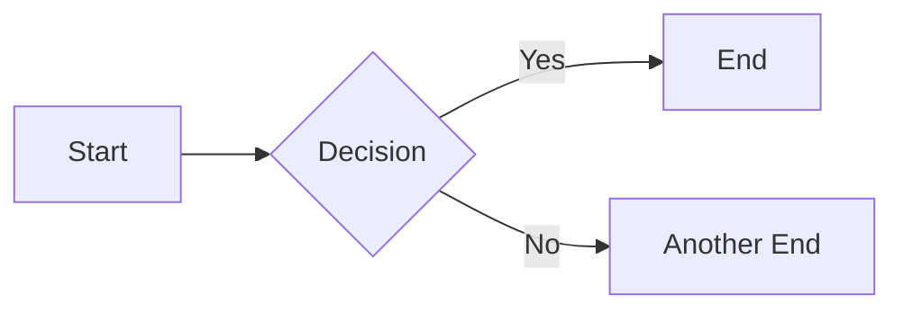

# Sample Page

Welcome to my Digital Garden! This is a sample page demonstrating various content types.

## Image Example


## Video Example

<video controls class="w-full mt-4">
  <source src="/static/videos/example.mp4" type="video/mp4">
  Your browser does not support the video tag.
</video>

## Diagram Example



## Code Snippet Example

```python
def greet(name):
    return f"Hello, {name}!"
```

## Collapsible Section Example

<button
hx-get=”/partials/collapsible-content”
hx-target=”#collapsible-section”
hx-swap=“innerHTML”
class=“px-4 py-2 bg-indigo-500 text-white rounded hover:bg-indigo-600”>
Toggle Details
</button>
<div id="collapsible-section" class="mt-2">
    <!-- Content loaded via HTMX -->
</div>
