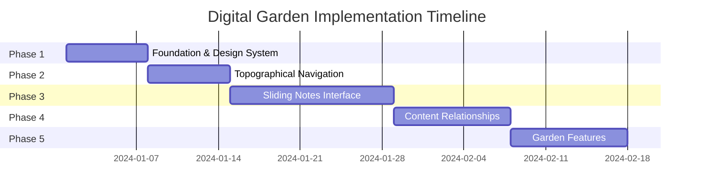

# Product Requirements Document: Digital Garden Modernization

## 1. Executive Summary

### 1.1 Project Overview
Transform the existing blog into a modern digital garden that embodies the philosophy of "topography over timelines," continuous growth, and learning in public. The redesign will maintain technical simplicity while introducing sophisticated visual design and navigation patterns inspired by leaders in the digital garden space.

### 1.2 Key Objectives
- Modernize visual design while maintaining the digital garden ethos
- Implement sliding notes interface for wandering/exploration
- Create topographical navigation (topics, paths, connections)
- Enhance content with growth stages and garden metaphors
- Maintain simplicity with minimal dependencies

### 1.3 Success Metrics
- Zero breaking changes to existing content or APIs
- Page load time under 2 seconds
- Mobile-responsive across all features
- All existing tests remain green
- No build step required for development

## 2. Background & Inspiration

### 2.1 Digital Garden Philosophy
Based on Maggie Appleton's "A Brief History & Ethos of the Digital Garden":
- **Topography over timelines**: Content organized by contextual relationships
- **Continuous growth**: Ideas evolve from seedlings to evergreen
- **Learning in public**: Embrace imperfection and transparency
- **Personal & experimental**: Non-standardized, playful design

### 2.2 Visual Inspiration
- **Maggie Appleton's Garden**: Organic palette, growth stages, visual metaphors
- **Andy Matuschak's Notes**: Sliding stacked notes interface for exploration

### 2.3 Current State Analysis
**Strengths:**
- FastAPI + HTMX + Tailwind stack already in place
- Markdown with YAML frontmatter
- Pydantic validation
- Infinite scroll implemented
- RSS and sitemap generation

**Opportunities:**
- Inconsistent Tailwind usage (CDN vs compiled)
- No dark mode implementation
- Linear chronological presentation
- Limited content interconnection
- Generic blog aesthetic

## 3. Technical Architecture

### 3.1 Tech Stack
```yaml
Backend:
  - FastAPI (existing)
  - Pydantic models (existing)
  - Markdown processing (existing)

Frontend:
  - HTMX (existing)
  - Alpine.js (new - 15KB)
  - Tailwind CSS (existing, needs unification)
  
No Additional Requirements:
  - No build step
  - No Node.js runtime
  - No database changes
```

### 3.2 Key Technical Decisions
- **Alpine.js**: Minimal (15KB) library for client-side state management
- **No DaisyUI**: Custom components to maintain unique garden aesthetic
- **CSS-first approach**: 90% visual work in pure CSS
- **Progressive enhancement**: Features degrade gracefully

## 4. Feature Requirements

### 4.1 Phase 1: Foundation (Week 1)

#### 4.1.1 Design System
**Color Palette:**
```css
Light Mode:
  - Background: Cream (#FAFAF8)
  - Primary: Sage (#6B8E6B, #A3B88C)
  - Secondary: Earth (#8B7355, #D4C5B9)
  - Accent: Sky (#5B8FA3)
  - Action: Emerald (existing)

Dark Mode (Night Garden):
  - Background: Deep blue-black (#1a1f2e)
  - Bioluminescent accents
  - Improved contrast ratios
```

**Typography:**
- Serif font for content (Crimson Text or Merriweather)
- Sans-serif for UI (Inter - existing)
- Fluid typography scaling
- Optional drop caps for articles

#### 4.1.2 Growth Stages System
```python
GROWTH_STAGES = {
    "seedling": {"emoji": "🌱", "color": "stone", "desc": "Just planted"},
    "budding": {"emoji": "🌿", "color": "amber", "desc": "Taking shape"},  
    "growing": {"emoji": "🪴", "color": "lime", "desc": "Developing"},
    "evergreen": {"emoji": "🌳", "color": "emerald", "desc": "Mature"}
}
```

#### 4.1.3 Vocabulary Updates
- Replace "Created/Updated" with "Planted/Last tended"
- Implement across all templates
- Update RSS feed descriptions

#### 4.1.4 Infrastructure Updates
- Remove Tailwind CDN from base.html
- Use compiled CSS (`/static/css/output.css`)
- Implement dark mode toggle with localStorage
- Unify CSS pipeline with npm scripts

### 4.2 Phase 2: Topographical Navigation (Week 2)

#### 4.2.1 Topic Index Page
- New route: `/topics`
- Display all tags with post counts
- Group related tags into "garden beds"
- Visual clustering of related topics
- HTMX-powered filtering

#### 4.2.2 Garden Paths
- Curated content sequences
- Manual definition in frontmatter
- Visual path indicators
- Progress tracking through paths

#### 4.2.3 Enhanced Homepage
- Replace linear feed with topographical layout
- "Recently tended" section
- "Explore by topic" call-to-action
- Visual growth stage indicators

### 4.3 Phase 3: Sliding Notes Interface (Week 3-4)

#### 4.3.1 Core Sliding Mechanism
```javascript
Features:
  - Horizontal sliding panels (desktop)
  - Vertical stack (mobile)
  - Smart stacking logic (replace if revisiting)
  - Smooth animations with Alpine.js
  - History management
  - Keyboard navigation
```

#### 4.3.2 Implementation Details

##### URL-Driven State Management
Building on concepts from "Bookmarkable by Design", all garden walks will be shareable and bookmarkable:

```python
# URL parameters for garden state
@app.get("/garden-walk")
async def garden_walk(
    path: str = Query(None),       # Comma-separated note IDs
    focus: int = Query(0),          # Which panel is active  
    view: str = Query("sliding"),   # View mode: sliding|stacked|single
    depth: int = Query(5),          # Max panels shown
    theme: str = Query("auto"),     # Theme preference
    tags: str = Query(None),        # Filter by tags
    status: str = Query(None)       # Filter by growth stage
):
    """
    Bookmarkable garden walks with full state preservation.
    Example: /garden-walk?path=digital-gardens,evergreen-notes&focus=1&view=sliding
    """
    notes = path.split(",") if path else []
    return templates.TemplateResponse(
        "garden_walk.html",
        {
            "notes": load_notes(notes),
            "focus": focus,
            "view": view,
            "current_url": request.url
        }
    )
```

##### HTMX Integration with URL State
```html
<!-- Each link updates URL state -->
<a href="/notes/evergreen"
   hx-get="/api/panel/notes/evergreen"
   hx-target="#note-stack"
   hx-swap="beforeend"
   hx-push-url="/garden-walk?path={{current_path}},evergreen&focus={{new_index}}"
   hx-vals='{"preserveState": true}'
   hx-include="#garden-state">
   Evergreen Notes
</a>

<!-- Hidden state preservation -->
<div id="garden-state">
  <input type="hidden" name="path" value="{{ current_path }}">
  <input type="hidden" name="focus" value="{{ focus }}">
  <input type="hidden" name="view" value="{{ view }}">
</div>
```

##### API Endpoints
```python
# New and updated endpoints
GET /api/panel/{content_type}/{note_name}  # Returns panel HTML
GET /garden-walk                           # Renders full walk from URL
POST /api/garden-walk/save                 # Save named path
GET /api/garden-walk/{name}                # Load named path
GET /api/garden-walk/share                 # Generate shareable link
```

##### Alpine.js State Synchronization
```javascript
function gardenWalk() {
  return {
    stack: [],
    currentIndex: 0,
    
    init() {
      // Initialize from URL parameters
      const params = new URLSearchParams(window.location.search);
      const path = params.get('path');
      if (path) {
        this.stack = path.split(',');
        this.currentIndex = parseInt(params.get('focus') || 0);
      }
    },
    
    openNote(noteId, fromPanel) {
      // Update stack
      const existingIndex = this.stack.findIndex(n => n.id === noteId);
      
      if (existingIndex >= 0) {
        this.stack = this.stack.slice(0, existingIndex + 1);
      } else {
        const insertAt = this.stack.indexOf(fromPanel) + 1;
        this.stack = this.stack.slice(0, insertAt);
        this.stack.push(noteId);
      }
      
      // Update URL without page reload
      this.updateURL();
      
      // Scroll to new note
      this.$nextTick(() => {
        this.$refs.stack.scrollTo({
          left: this.$refs.stack.scrollWidth,
          behavior: 'smooth'
        });
      });
    },
    
    updateURL() {
      const params = new URLSearchParams({
        path: this.stack.join(','),
        focus: this.currentIndex,
        view: 'sliding'
      });
      
      // Use HTMX to update URL
      htmx.ajax('GET', `/garden-walk?${params}`, {
        target: '#url-state',
        swap: 'none',
        pushUrl: true
      });
    },
    
    shareCurrentPath() {
      const url = new URL(window.location);
      
      if (navigator.share) {
        navigator.share({
          title: 'My Garden Walk',
          text: `Follow my path: ${this.stack.map(id => id.replace('-', ' ')).join(' → ')}`,
          url: url.href
        });
      } else {
        navigator.clipboard.writeText(url.href);
        // Show toast notification
      }
    }
  }
}
```

#### 4.3.3 Visual Design
- Panels get smaller/dimmer with depth
- Color progression indicating depth
- Visual connectors between related panels
- Close/minimize controls

#### 4.3.4 Mobile Adaptation
- Vertical card stack
- Swipe gestures for navigation
- Peek preview of next/previous
- Collapse to overview mode

### 4.4 Phase 4: Content Relationships (Week 4-5)

#### 4.4.1 Bidirectional Linking
- Parse internal links during rendering
- Generate "Referenced by" sections
- Preview popovers on hover
- Visual link indicators

#### 4.4.2 Related Content
- "Companion plants" section
- Tag-based relationships
- Manual curation option
- Visual connection indicators

#### 4.4.3 Knowledge Graph
- Optional D3.js visualization
- Nodes sized by connections
- Color by growth stage
- Filter by topic/date/stage
- Click to navigate

### 4.5 Phase 5: Garden Features (Week 5-6)

#### 4.5.1 Garden Statistics Dashboard
```yaml
Route: /garden-stats
Displays:
  - Seeds planted (total posts)
  - Garden beds (topic areas)
  - Cross-pollination (connections)
  - Tending streak
  - Growth timeline
  - Public changelog
  - Popular garden paths (most visited walks)
  - Path completion rates
```

#### 4.5.2 Special Garden Areas
- **Digital Greenhouse**: Draft preview area
- **Compost Bin**: Archived/deprecated ideas
- **Garden Journal**: Public learning log
- **Garden Paths**: Curated tours with bookmarkable URLs

##### Named Garden Paths
```python
# Predefined curated paths
CURATED_PATHS = {
    "getting-started": {
        "name": "Getting Started with Digital Gardens",
        "path": ["what-is-digital-garden", "evergreen-notes", "zettelkasten"],
        "description": "A gentle introduction to digital gardening concepts"
    },
    "htmx-journey": {
        "name": "Learning HTMX",
        "path": ["htmx-intro", "htmx-attributes", "htmx-patterns"],
        "description": "From basics to advanced HTMX patterns"
    }
}

@app.get("/garden-path/{path_name}")
async def named_garden_path(path_name: str):
    """Load a curated garden path by name"""
    if path_name in CURATED_PATHS:
        path_data = CURATED_PATHS[path_name]
        return RedirectResponse(
            url=f"/garden-walk?path={','.join(path_data['path'])}&focus=0"
        )
```

#### 4.5.3 Interactive Elements
- "Wander" button for random discovery
- Seasonal theme variations (optional)
- Growth animations on status change
- "Tend this note" widget
- **Share Path** button with multiple options:
  - Copy link to clipboard
  - Share via native share API
  - Generate QR code for mobile
  - Export as markdown journey

#### 4.5.4 Path Analytics & Social Features
```python
class GardenPath(BaseModel):
    id: str
    path: List[str]
    created_by: Optional[str]
    visits: int = 0
    completions: int = 0
    average_time: Optional[float]
    rating: Optional[float]
    
@app.post("/api/garden-walk/track")
async def track_path_analytics(
    path: str,
    event: str,  # "start", "complete", "abandon"
    time_spent: Optional[float] = None
):
    """Track how users navigate garden paths"""
    # Analytics for understanding popular routes
    pass
```

## 5. User Experience

### 5.1 Navigation Patterns
```yaml
Primary Navigation:
  - Home (Garden entrance)
  - Topics (Garden map)
  - Wander (Random exploration)
  - Now (Current focus)
  - Journal (Recent activity)

Content Navigation:
  - Sliding panels for exploration
  - Tag filtering with HTMX
  - Status filtering
  - Search (progressive enhancement)
```

### 5.2 Mobile Experience
- Responsive breakpoints at 768px and 1024px
- Touch gestures for panel navigation
- Simplified garden map for mobile
- Bottom sheet pattern for filters

### 5.3 Accessibility Requirements
- WCAG 2.1 AA compliance
- Keyboard navigation for all features
- ARIA labels for interactive elements
- Skip links in navigation
- Sufficient color contrast in both themes

## 6. Implementation Plan

### 6.1 Development Phases



### 6.2 File Structure Changes
```
app/
├── templates/
│   ├── topics.html (new)
│   ├── garden-stats.html (new)
│   ├── partials/
│   │   ├── sliding_note.html (new)
│   │   ├── backlinks.html (new)
│   │   └── related.html (new)
│   └── base.html (updated)
├── static/
│   ├── css/
│   │   └── garden.css (new)
│   └── js/
│       └── garden-walk.js (new)
└── models.py (updated)
```

### 6.3 API Additions
```python
# New endpoints
GET /topics
GET /api/panel/{content_type}/{note_name}
GET /garden-stats
GET /wander
GET /api/backlinks/{content_type}/{note_name}
```

### 6.4 Model Updates
```python
class BaseContent(BaseModel):
    # Existing fields...
    growth_stage: str = "seedling"  # New
    tended_count: int = 0  # New
    connections: List[str] = []  # New
    garden_bed: Optional[str] = None  # New
```

## 7. SEO Optimization Strategy

### 7.1 Technical SEO Foundation

#### 7.1.1 Meta Tags & Structured Data
```python
class SEOMetadata(BaseModel):
    title: str  # Max 60 chars
    description: str  # Max 155 chars
    keywords: List[str]
    author: str = "Joshua Oliphant"
    og_image: Optional[str]
    twitter_card: str = "summary_large_image"
    canonical_url: str
    published_date: datetime
    modified_date: datetime
    
@app.get("/{content_type}/{note_name}")
async def content_page(content_type: str, note_name: str):
    content = get_content(content_type, note_name)
    
    # Generate SEO metadata
    seo = SEOMetadata(
        title=f"{content.title} | Digital Garden",
        description=content.excerpt[:155],
        keywords=content.tags,
        canonical_url=f"https://yourdomain.com/{content_type}/{note_name}",
        published_date=content.created,
        modified_date=content.updated
    )
    
    return templates.TemplateResponse(
        "content_page.html",
        {"content": content, "seo": seo}
    )
```

#### 7.1.2 Schema.org Structured Data
```html
<!-- Add to base.html -->
<script type="application/ld+json">
{
  "@context": "https://schema.org",
  "@type": "BlogPosting",
  "headline": "{{ seo.title }}",
  "description": "{{ seo.description }}",
  "author": {
    "@type": "Person",
    "name": "{{ seo.author }}",
    "url": "https://yourdomain.com/about"
  },
  "datePublished": "{{ seo.published_date }}",
  "dateModified": "{{ seo.modified_date }}",
  "mainEntityOfPage": {
    "@type": "WebPage",
    "@id": "{{ seo.canonical_url }}"
  },
  "keywords": "{{ seo.keywords|join(', ') }}",
  "articleSection": "{{ content.garden_bed }}"
}
</script>

<!-- Digital Garden specific schema -->
<script type="application/ld+json">
{
  "@context": "https://schema.org",
  "@type": "LearningResource",
  "educationalLevel": "{{ content.difficulty }}",
  "learningResourceType": "{{ content.type }}",
  "timeRequired": "PT{{ reading_time }}M",
  "inLanguage": "en",
  "isBasedOn": {{ content.connections|tojson }}
}
</script>
```

### 7.2 Content SEO

#### 7.2.1 URL Structure
```yaml
Best Practices:
  - Use descriptive slugs: /notes/understanding-digital-gardens
  - Avoid parameters for content: /notes/123 ❌ → /notes/digital-gardens ✅
  - Implement redirects for renamed content
  - Keep URLs short and memorable
  
URL Patterns:
  - /notes/{slug} - Individual notes
  - /topics/{topic} - Topic pages (hub pages)
  - /garden-path/{name} - Curated learning paths
  - /tags/{tag} - Tag archive pages
```

#### 7.2.2 Content Optimization
```python
class ContentSEO:
    """SEO enhancements for content"""
    
    def optimize_content(self, content: str, metadata: dict):
        # Auto-generate meta description if missing
        if not metadata.get('description'):
            metadata['description'] = self.extract_excerpt(content, 155)
        
        # Ensure headings hierarchy (only one H1)
        content = self.fix_heading_hierarchy(content)
        
        # Add alt text to images
        content = self.add_image_alt_text(content)
        
        # Internal linking suggestions
        content = self.suggest_internal_links(content)
        
        return content, metadata
    
    def generate_breadcrumbs(self, content_type: str, note_name: str):
        """Generate breadcrumb schema"""
        return {
            "@type": "BreadcrumbList",
            "itemListElement": [
                {"@type": "ListItem", "position": 1, "name": "Home", "item": "/"},
                {"@type": "ListItem", "position": 2, "name": content_type.title(), "item": f"/{content_type}"},
                {"@type": "ListItem", "position": 3, "name": note_name, "item": f"/{content_type}/{note_name}"}
            ]
        }
```

### 7.3 Performance SEO

#### 7.3.1 Core Web Vitals
```yaml
Targets:
  - LCP (Largest Contentful Paint): < 2.5s
  - FID (First Input Delay): < 100ms
  - CLS (Cumulative Layout Shift): < 0.1
  
Implementation:
  - Preload critical fonts
  - Lazy load images below fold
  - Inline critical CSS
  - Defer non-essential JavaScript
  - Set explicit dimensions for media
```

#### 7.3.2 Speed Optimizations
```html
<!-- Add to base.html -->
<!-- Preload critical resources -->
<link rel="preload" href="/static/fonts/Inter.woff2" as="font" type="font/woff2" crossorigin>
<link rel="preload" href="/static/css/output.css" as="style">

<!-- DNS prefetch for external resources -->
<link rel="dns-prefetch" href="https://unpkg.com">

<!-- Preconnect to required origins -->
<link rel="preconnect" href="https://unpkg.com">

<!-- Resource hints for next navigation -->
<link rel="prefetch" href="/topics">
<link rel="prerender" href="/notes/getting-started">
```

### 7.4 Crawlability & Indexing

#### 7.4.1 Sitemap Generation
```python
from fastapi.responses import Response
import xml.etree.ElementTree as ET

@app.get("/sitemap.xml", response_class=Response)
async def sitemap():
    """Generate dynamic sitemap with all content"""
    urlset = ET.Element("urlset")
    urlset.set("xmlns", "http://www.sitemaps.org/schemas/sitemap/0.9")
    
    # Add all content with priority based on growth stage
    priorities = {
        "evergreen": 1.0,
        "growing": 0.8,
        "budding": 0.6,
        "seedling": 0.4
    }
    
    for content in get_all_content():
        url = ET.SubElement(urlset, "url")
        ET.SubElement(url, "loc").text = f"https://yourdomain.com{content.url}"
        ET.SubElement(url, "lastmod").text = content.updated.isoformat()
        ET.SubElement(url, "changefreq").text = "weekly"
        ET.SubElement(url, "priority").text = str(priorities.get(content.growth_stage, 0.5))
    
    return Response(
        content=ET.tostring(urlset, encoding="unicode"),
        media_type="application/xml"
    )
```

#### 7.4.2 Robots.txt
```
User-agent: *
Allow: /

# Block API endpoints from crawling
Disallow: /api/
Disallow: /admin/

# Point to sitemap
Sitemap: https://yourdomain.com/sitemap.xml

# Crawl-delay for respectful crawling
Crawl-delay: 1
```

### 7.5 Digital Garden Specific SEO

#### 7.5.1 Growth Stage SEO Strategy
```python
def get_indexing_priority(content):
    """Adjust indexing based on content maturity"""
    if content.growth_stage == "seedling":
        # Lower priority, might change frequently
        return {"index": "noindex", "follow": "follow"}
    elif content.growth_stage == "evergreen":
        # High priority, stable content
        return {"index": "index", "follow": "follow", "priority": "high"}
```

#### 7.5.2 Garden Path SEO
```python
@app.get("/garden-path/{path_name}")
async def garden_path_seo(path_name: str):
    """SEO-optimized garden paths"""
    path_data = CURATED_PATHS[path_name]
    
    # Create rich snippet for learning path
    return {
        "@type": "Course",
        "name": path_data["name"],
        "description": path_data["description"],
        "hasCourseInstance": {
            "@type": "CourseInstance",
            "courseMode": "online",
            "duration": f"PT{len(path_data['path']) * 10}M"
        }
    }
```

### 7.6 Local & Social SEO

#### 7.6.1 Open Graph Tags
```html
<!-- Essential OG tags -->
<meta property="og:title" content="{{ seo.title }}">
<meta property="og:description" content="{{ seo.description }}">
<meta property="og:image" content="{{ seo.og_image or '/static/images/garden-default.jpg' }}">
<meta property="og:url" content="{{ seo.canonical_url }}">
<meta property="og:type" content="article">
<meta property="og:site_name" content="Joshua's Digital Garden">

<!-- Twitter Card -->
<meta name="twitter:card" content="summary_large_image">
<meta name="twitter:title" content="{{ seo.title }}">
<meta name="twitter:description" content="{{ seo.description }}">
<meta name="twitter:image" content="{{ seo.og_image }}">
```

#### 7.6.2 RSS Feed Enhancement
```python
@app.get("/feed.xml")
async def enhanced_rss():
    """SEO-optimized RSS feed"""
    # Include full content for better syndication
    # Add categories and tags
    # Include media (images)
    # Set proper cache headers
    pass
```

### 7.7 Monitoring & Analytics

#### 7.7.1 SEO Monitoring Setup
```yaml
Tools to Implement:
  - Google Search Console verification
  - Bing Webmaster Tools
  - Schema markup validator
  - Core Web Vitals monitoring
  
Tracking:
  - Organic traffic by content type
  - Search queries leading to garden
  - Click-through rates by growth stage
  - Page speed by device type
```

#### 7.7.2 SEO Dashboard
```python
@app.get("/admin/seo-dashboard")
async def seo_dashboard():
    """Internal SEO monitoring dashboard"""
    return {
        "indexed_pages": count_indexed(),
        "avg_position": get_avg_position(),
        "top_queries": get_top_search_queries(),
        "crawl_errors": get_crawl_errors(),
        "core_web_vitals": get_cwv_scores()
    }
```

## 8. Testing Requirements

### 8.1 Unit Tests
- Growth stage validation
- Backlink parsing logic
- Panel state management
- Dark mode persistence
- **SEO metadata generation**
- **Sitemap XML generation**

### 8.2 Integration Tests
- HTMX partial rendering
- Alpine.js state synchronization
- Navigation history management
- Mobile responsive behavior
- **Schema.org structured data validation**
- **Open Graph tag rendering**

### 8.3 Performance Tests
- Page load time < 2 seconds
- Smooth animations at 60fps
- Efficient panel loading
- Memory management for many open panels
- **Core Web Vitals scores**
- **Time to First Byte (TTFB) < 600ms**

## 9. Success Criteria

### 9.1 Functional Requirements
- [ ] All existing content remains accessible
- [ ] All existing tests pass
- [ ] Dark mode toggle works and persists
- [ ] Sliding notes interface functions on desktop/mobile
- [ ] Growth stages display correctly
- [ ] Topographical navigation implemented
- [ ] **URL state management works for all garden walks**
- [ ] **Bookmarkable paths can be shared and restored**
- [ ] **Browser back/forward navigation preserves state**

### 9.2 Non-Functional Requirements
- [ ] No build step required
- [ ] Page load under 2 seconds
- [ ] Lighthouse score > 90
- [ ] Mobile responsive
- [ ] Accessible (WCAG 2.1 AA)
- [ ] **URLs remain under 2000 character limit**
- [ ] **State persists across page refreshes**

### 9.3 SEO Requirements
- [ ] All pages have unique meta titles and descriptions
- [ ] Schema.org structured data implemented
- [ ] Sitemap.xml dynamically generated
- [ ] Core Web Vitals pass (LCP < 2.5s, FID < 100ms, CLS < 0.1)
- [ ] Open Graph tags on all content
- [ ] Growth stage affects indexing priority
- [ ] Google Search Console connected
- [ ] Clean URL structure without parameters

### 9.4 User Experience Goals
- [ ] "Garden feel" achieved through visual design
- [ ] Exploration feels natural and engaging
- [ ] Content relationships are discoverable
- [ ] Mobile experience is smooth
- [ ] Dark mode is pleasant for reading

## 10. Risks & Mitigations

### 10.1 Technical Risks
| Risk | Impact | Mitigation |
|------|--------|------------|
| Alpine.js conflicts with HTMX | High | Test integration early, have pure CSS fallback |
| Performance with many panels | Medium | Implement panel limit, lazy loading |
| Mobile gesture complexity | Medium | Progressive enhancement, simple fallback |
| SEO impact from dynamic content | Low | Server-side rendering for initial load |

### 10.2 Design Risks
| Risk | Impact | Mitigation |
|------|--------|------------|
| Over-metaphoring the garden concept | Medium | User test, keep navigation clear |
| Sliding interface confusing | Medium | Optional toggle, good onboarding |
| Dark mode contrast issues | Low | Thorough testing, accessibility tools |

## 11. Future Enhancements (Post-MVP)

### 11.1 Advanced Features
- Full-text search with Tantivy or MeiliSearch
- RSS feeds per growth stage or topic
- Social sharing cards with growth stage
- Reader annotations and paths
- Export personal learning paths

### 11.2 Garden Intelligence
- AI-suggested connections
- Auto-categorization of new content
- Growth stage progression tracking
- Reading time estimates
- Content decay indicators for old posts

### 11.3 Community Features
- Public garden paths by readers
- "Tended by others" indicators
- Garden visiting (linking between gardens)
- Collaborative paths

## 12. Appendix

### 12.1 References
- [Maggie Appleton's Digital Garden](https://maggieappleton.com/garden)
- [Digital Garden History & Ethos](https://maggieappleton.com/garden-history)
- [Andy Matuschak's Notes](https://notes.andymatuschak.org)
- [Bookmarkable by Design: URL State with HTMX](https://www.lorenstew.art/blog/bookmarkable-by-design-url-state-htmx/)
- [HTMX Documentation](https://htmx.org)
- [Alpine.js Documentation](https://alpinejs.dev)

### 12.2 Design Assets Needed
- Garden-themed icons (growth stages, tools, etc.)
- Subtle background patterns
- Loading animations (growing plants)
- Seasonal color palettes
- Typography specimens

### 12.3 Dependencies
```json
{
  "dependencies": {
    "tailwindcss": "^3.x",
    "@tailwindcss/typography": "^0.5.x",
    "alpinejs": "^3.x"
  },
  "devDependencies": {
    "postcss": "^8.x",
    "autoprefixer": "^10.x"
  }
}
```

### 12.4 Browser Support
- Chrome/Edge: Last 2 versions
- Firefox: Last 2 versions
- Safari: Last 2 versions
- Mobile browsers: iOS Safari 14+, Chrome Mobile

---

**Document Version:** 1.2  
**Last Updated:** 2024  
**Author:** Claude & LaBoeuf  
**Status:** Ready for Review  

**Changes:**
- **v1.1:** Added comprehensive URL state management based on "Bookmarkable by Design" principles
- **v1.2:** Added complete SEO optimization strategy including technical SEO, content optimization, performance metrics, and digital garden-specific SEO features
