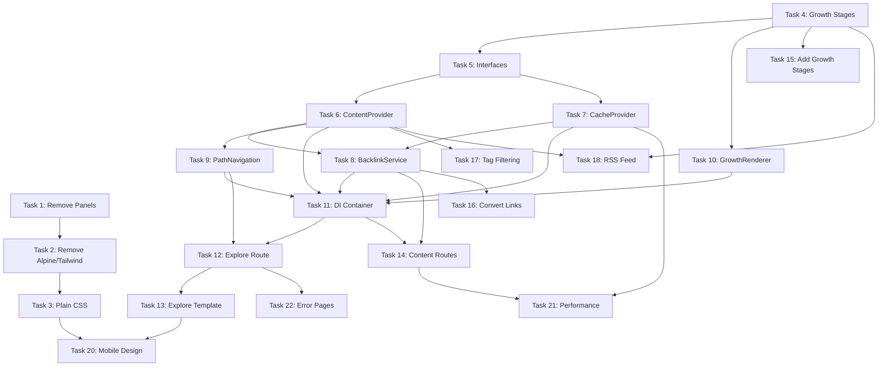

# Plain Text Digital Garden - TDD Implementation Plan

## Executive Summary

This plan provides a comprehensive Test-Driven Development approach for transforming the existing blog into a Plain Text Digital Garden. The implementation follows strict TDD principles with 22 discrete tasks organized into 5 phases.

**Timeline**: 4 weeks
**Complexity**: Medium-High
**Test Coverage Target**: 90%+

## Architecture Overview

### System Design

```
┌─────────────────────────────────────────────────┐
│              FastAPI Application                 │
├─────────────────────────────────────────────────┤
│                   Services                       │
│  ┌──────────────┐  ┌──────────────────┐        │
│  │ContentService│  │PathNavigation   │         │
│  │              │  │Service          │         │
│  └──────────────┘  └──────────────────┘        │
│  ┌──────────────┐  ┌──────────────────┐        │
│  │Backlink      │  │GrowthStage      │         │
│  │Service       │  │Service          │         │
│  └──────────────┘  └──────────────────┘        │
├─────────────────────────────────────────────────┤
│                  Providers                       │
│  ┌──────────────┐  ┌──────────────────┐        │
│  │Content       │  │Cache            │         │
│  │Provider      │  │Provider         │         │
│  └──────────────┘  └──────────────────┘        │
├─────────────────────────────────────────────────┤
│                 Infrastructure                   │
│  ┌──────────────┐  ┌──────────────────┐        │
│  │Dependency    │  │Error            │         │
│  │Container     │  │Handling         │         │
│  └──────────────┘  └──────────────────┘        │
└─────────────────────────────────────────────────┘
```

### Key Design Principles

1. **Separation of Concerns**: Each component has a single responsibility
2. **Dependency Injection**: All dependencies injected via constructor
3. **Interface-Based Design**: Components depend on interfaces, not implementations
4. **Testability First**: Every component testable in isolation
5. **URL-Driven State**: All application state lives in URLs

## Technology Stack

- **Backend**: FastAPI (existing)
- **Frontend**: HTMX (replacing Alpine.js)
- **Styling**: Plain CSS (replacing Tailwind)
- **Markdown**: Python-markdown with Pygments
- **Testing**: pytest with pytest-asyncio
- **Deployment**: Fly.io via GitHub Actions

## Task Breakdown

### Phase 1: Foundation (5 Tasks)

#### Task 1: Remove Sliding Panel Infrastructure
**Complexity**: 2/5 | **Test Units**: 3 | **Dependencies**: None

**AI Implementation Prompt:**
```text
Think carefully about implementing the removal of sliding panel infrastructure using strict TDD principles.

**Previous Context**:
The existing Digital Garden has sliding panel functionality including JavaScript navigation and HTML templates. This infrastructure needs complete removal as part of transitioning to a plain text, URL-driven design.

**Your Task**:
Remove all sliding panel infrastructure including JavaScript files, HTML templates, and any references in base templates. Ensure no traces of the panel system remain in the codebase.

**Tests to Write FIRST** (must fail initially):
1. test_panel_navigation_js_removed() - Verify app/static/js/panel-navigation.js no longer exists
2. test_sliding_panel_template_removed() - Verify app/templates/partials/sliding_panel.html no longer exists  
3. test_base_html_has_no_panel_scripts() - Verify base.html contains no references to panel-navigation.js
4. test_no_panel_css_classes() - Verify no sliding panel CSS classes remain in templates
5. test_no_panel_html_elements() - Verify no panel-specific HTML elements exist in templates

**Implementation Approach**:
- Use file system operations to safely remove files
- Use regex patterns to find and remove template references
- Follow defensive deletion patterns (backup before removal)
- Use git tracking to verify clean removal

**Integration Requirements**:
1. Update app/templates/base.html to remove script tags and panel references
2. Remove any CSS styles related to panel functionality
3. Clean up any remaining JavaScript event handlers

**Success Validation**:
- All tests pass
- No regression in existing tests
- No broken template references
- Git shows clean file deletions

Begin by writing the failing tests.
```

#### Task 2: Remove Alpine.js and Tailwind CSS
**Complexity**: 3/5 | **Test Units**: 5 | **Dependencies**: Task 1

**AI Implementation Prompt:**
```text
Think carefully about implementing the removal of Alpine.js and Tailwind CSS using strict TDD principles.

**Previous Context**:
With sliding panels removed (Task 1), the next step is eliminating client-side JavaScript frameworks and utility CSS. The application currently uses Alpine.js for interactivity and Tailwind for styling. These must be completely removed in preparation for plain CSS implementation.

**Your Task**:
Remove all Alpine.js directives (x-data, x-show, etc.) and Tailwind CSS classes from templates. Remove Alpine.js and Tailwind dependencies from build systems and package.json.

**Tests to Write FIRST** (must fail initially):
1. test_no_alpine_directives_in_templates() - Verify no x-data, x-show, x-if, x-click attributes exist in any template
2. test_no_alpine_references() - Verify no "Alpine" strings exist in HTML files
3. test_no_tailwind_classes_in_templates() - Verify no Tailwind utility classes (flex, grid, p-4, m-2, etc.) exist
4. test_package_json_dependencies_removed() - Verify Alpine.js and Tailwind removed from package.json
5. test_no_tailwind_config_file() - Verify tailwind.config.js is removed
6. test_templates_still_render() - Verify all templates render without JavaScript errors

**Implementation Approach**:
- Use comprehensive regex patterns to find Alpine.js directives
- Create mapping of Tailwind classes to identify all occurrences
- Use AST parsing for accurate JavaScript dependency removal
- Follow systematic template-by-template cleaning approach

**Integration Requirements**:
1. Update all template files in app/templates/ directory tree
2. Remove Alpine.js and Tailwind from package.json dependencies
3. Remove or update any build scripts that reference these frameworks
4. Ensure existing template functionality remains intact

**Success Validation**:
- All tests pass
- No regression in existing tests
- Templates render cleanly without JavaScript errors
- Build system works without removed dependencies

Begin by writing the failing tests.
```

#### Task 3: Create Plain CSS Typography System
**Complexity**: 2/5 | **Test Units**: 4 | **Dependencies**: Task 2

**AI Implementation Prompt:**
```text
Think carefully about implementing a plain CSS typography system using strict TDD principles.

**Previous Context**:
Alpine.js and Tailwind CSS have been removed (Task 2). The application now needs a custom CSS system focused on typography and readability. This forms the visual foundation for the plain text digital garden aesthetic.

**Your Task**:
Create a comprehensive CSS typography system with JetBrains Mono font, dark theme (#1a1a1a background), optimal reading width (65ch), and semantic HTML styling for markdown content.

**Tests to Write FIRST** (must fail initially):
1. test_main_css_file_exists() - Verify app/static/css/main.css exists
2. test_jetbrains_mono_font_defined() - Verify CSS contains 'font-family: "JetBrains Mono"' declaration
3. test_dark_theme_colors_defined() - Verify CSS contains 'background: #1a1a1a' and appropriate text colors
4. test_optimal_reading_width() - Verify CSS contains 'max-width: 65ch' for main content
5. test_typography_hierarchy_defined() - Verify h1-h6, p, code, blockquote styles are defined
6. test_css_linked_in_base_template() - Verify base.html links to main.css

**Implementation Approach**:
- Use semantic CSS class naming (content, article, heading, etc.)
- Follow progressive enhancement principles
- Use CSS custom properties for theme variables
- Implement mobile-first responsive design patterns

**Integration Requirements**:
1. Create app/static/css/main.css with complete typography system
2. Update app/templates/base.html to link CSS file
3. Apply CSS classes to existing content templates
4. Ensure proper font loading and fallbacks

**Success Validation**:
- All tests pass
- No regression in existing tests
- Typography renders correctly across browsers
- Font loading works with proper fallbacks

Begin by writing the failing tests.
```

#### Task 4: Add Growth Stage Enum and Model
**Complexity**: 1/5 | **Test Units**: 5 | **Dependencies**: None

**AI Implementation Prompt:**
```text
Think carefully about implementing growth stage enumeration and model updates using strict TDD principles.

**Previous Context**:
The plain CSS typography system is now in place (Task 3). The digital garden concept requires content to have growth stages representing maturity: seedling (new ideas), budding (developing concepts), growing (maturing thoughts), and evergreen (polished content).

**Your Task**:
Create a GrowthStage enum with four stages and update the BaseContent model to include a growth field. Ensure proper validation and serialization for both new and existing content.

**Tests to Write FIRST** (must fail initially):
1. test_growth_stage_enum_values() - Verify GrowthStage enum has SEEDLING, BUDDING, GROWING, EVERGREEN values
2. test_growth_stage_string_values() - Verify enum values are "seedling", "budding", "growing", "evergreen"
3. test_base_content_growth_field() - Verify BaseContent model accepts growth parameter
4. test_growth_field_validation() - Verify invalid growth values raise ValidationError
5. test_growth_field_serialization() - Verify growth field serializes correctly to JSON
6. test_existing_content_default_growth() - Verify existing content gets default growth stage

**Implementation Approach**:
- Use Python Enum class for type safety
- Extend Pydantic BaseContent model with new field
- Use Pydantic validators for enum validation
- Follow existing model patterns in app/models.py

**Integration Requirements**:
1. Update app/models.py to add GrowthStage enum
2. Update BaseContent model to include growth: GrowthStage field
3. Ensure backward compatibility with existing content
4. Update any content creation/parsing logic

**Success Validation**:
- All tests pass
- No regression in existing tests
- Enum values are properly typed and validated
- Existing content continues to load correctly

Begin by writing the failing tests.
```

#### Task 5: Create Content Interfaces
**Complexity**: 2/5 | **Test Units**: 3 | **Dependencies**: Task 4

**AI Implementation Prompt:**
```text
Think carefully about implementing content service interfaces using strict TDD principles.

**Previous Context**:
The GrowthStage enum and model updates are complete (Task 4). The architecture requires well-defined interfaces for dependency injection and testability. Two key interfaces are needed: IContentProvider for content operations and IBacklinkService for link analysis.

**Your Task**:
Create abstract base classes defining IContentProvider and IBacklinkService interfaces. These interfaces will enable dependency injection and provide clear contracts for future service implementations.

**Tests to Write FIRST** (must fail initially):
1. test_content_provider_interface_exists() - Verify IContentProvider abstract base class exists
2. test_content_provider_required_methods() - Verify interface defines get_content_by_slug, get_all_content, get_content_by_tag methods
3. test_backlink_service_interface_exists() - Verify IBacklinkService abstract base class exists
4. test_backlink_service_required_methods() - Verify interface defines get_backlinks, extract_internal_links methods
5. test_interfaces_are_abstract() - Verify interfaces cannot be instantiated directly
6. test_interface_method_signatures() - Verify methods have correct type hints and return types

**Implementation Approach**:
- Use Python ABC (Abstract Base Class) module for interface definition
- Use proper type hints with typing module (List, Dict, Optional, etc.)
- Follow dependency inversion principle from SOLID
- Use Protocol classes for structural typing where appropriate

**Integration Requirements**:
1. Create interfaces in new app/interfaces/ module
2. Ensure interfaces align with existing ContentManager functionality
3. Plan for future service implementations using these interfaces
4. Set up proper import structure for interface visibility

**Success Validation**:
- All tests pass
- No regression in existing tests
- Interfaces are properly abstract and cannot be instantiated
- Method signatures are clearly defined with proper types

Begin by writing the failing tests.
```

### Phase 2: Service Implementation (6 Tasks)

#### Task 6: Implement Content Service
**Complexity**: 3/5 | **Test Units**: 8 | **Dependencies**: Task 5

**AI Implementation Prompt:**
```text
Think carefully about implementing a ContentService class using strict TDD principles.

**Previous Context**:
- Growth Stage enum and BaseContent model are implemented with validation
- Content interfaces (IContentProvider, IBacklinkService) are defined
- Plain CSS typography system is in place
- All Alpine.js and Tailwind dependencies removed
- Content files exist in app/content/ directories with YAML frontmatter

**Your Task**:
Implement ContentService class that implements IContentProvider interface, handling markdown parsing with YAML frontmatter, content discovery, and caching.

**Tests to Write FIRST** (must fail initially):
1. test_content_service_implements_interface() - Verify ContentService implements IContentProvider
2. test_get_content_by_slug_returns_parsed_content() - Test parsing markdown with frontmatter for valid slug
3. test_get_content_by_slug_returns_none_for_missing() - Test behavior when slug doesn't exist
4. test_get_all_content_returns_all_parsed_files() - Test discovery and parsing of all content files
5. test_content_parsing_validates_growth_stage() - Test that invalid growth stages raise ValidationError
6. test_content_caching_works_correctly() - Test that repeated calls return cached results
7. test_content_filters_by_status_published_only() - Test that draft content is filtered out
8. test_markdown_to_html_conversion_works() - Test markdown parsing with Python-markdown

**Implementation Approach**:
- Use Python-markdown library for markdown parsing
- Implement frontmatter parsing with PyYAML
- Use pathlib for file system operations
- Implement simple in-memory caching with TTL
- Follow the existing project pattern of pydantic model validation

**Integration Requirements**:
1. Connect to BaseContent and other content models for validation
2. Update app/services/__init__.py to export ContentService
3. Wire into the dependency injection system when Task 11 is complete

**Success Validation**:
- All tests pass
- No regression in existing tests
- Code follows project patterns
- Integration verified

Begin by writing the failing tests.
```

#### Task 7: Implement Backlink Service
**Complexity**: 3/5 | **Test Units**: 7 | **Dependencies**: Task 5

**AI Implementation Prompt:**
```text
Think carefully about implementing a BacklinkService class using strict TDD principles.

**Previous Context**:
- ContentService is implemented and provides access to all parsed content
- IBacklinkService interface is defined with get_backlinks and extract_internal_links methods
- Content models support internal linking via markdown link syntax
- All content is accessible via slug-based routing

**Your Task**:
Implement BacklinkService class that implements IBacklinkService interface, extracting internal links from markdown content and building bidirectional link relationships.

**Tests to Write FIRST** (must fail initially):
1. test_backlink_service_implements_interface() - Verify BacklinkService implements IBacklinkService
2. test_extract_internal_links_finds_markdown_links() - Test extraction of [[wikilinks]] and [text](slug) links
3. test_extract_internal_links_ignores_external_links() - Test that http:// links are ignored
4. test_get_backlinks_returns_linking_content() - Test finding all content that links to a specific slug
5. test_get_backlinks_handles_circular_references() - Test that A->B and B->A doesn't cause issues
6. test_backlink_extraction_handles_invalid_slugs() - Test behavior when linked slug doesn't exist
7. test_backlink_caching_improves_performance() - Test that backlink calculations are cached
8. test_backlink_service_works_with_empty_content() - Test behavior when no content exists

**Implementation Approach**:
- Use regex patterns to extract [[wikilinks]] and [text](slug) patterns
- Implement caching to avoid O(n²) performance issues
- Follow dependency injection pattern, requiring IContentProvider
- Handle edge cases gracefully (missing links, circular references)

**Integration Requirements**:
1. Connect to ContentService via IContentProvider interface
2. Update app/services/__init__.py to export BacklinkService
3. Wire into dependency injection container in Task 11

**Success Validation**:
- All tests pass
- No regression in existing tests
- Code follows project patterns
- Integration verified

Begin by writing the failing tests.
```

#### Task 8: Create Path Accumulator Service
**Complexity**: 4/5 | **Test Units**: 10 | **Dependencies**: Tasks 5, 6

**AI Implementation Prompt:**
```text
Think carefully about implementing a PathAccumulatorService class using strict TDD principles.

**Previous Context**:
- ContentService provides access to all content with metadata
- The application uses URL-driven state management (no client-side state)
- HTMX will be used for dynamic navigation without full page reloads
- All navigation paths need to be preserved in URL query parameters

**Your Task**:
Implement PathAccumulatorService class that manages URL query parameters for path accumulation, allowing users to build up complex navigation trails that persist in URLs.

**Tests to Write FIRST** (must fail initially):
1. test_add_path_creates_new_query_param() - Test adding first path to empty URL
2. test_add_path_appends_to_existing_paths() - Test accumulating multiple paths in order
3. test_remove_path_removes_specific_path() - Test removing a path from the middle of trail
4. test_get_current_paths_returns_ordered_list() - Test retrieving current path trail as list
5. test_clear_paths_removes_all_parameters() - Test clearing entire path trail
6. test_path_deduplication_prevents_cycles() - Test that same path isn't added twice in a row
7. test_url_encoding_handles_special_characters() - Test proper URL encoding of path segments
8. test_max_path_depth_prevents_infinite_trails() - Test limiting path accumulation to reasonable depth

**Implementation Approach**:
- Use urllib.parse for URL manipulation and encoding
- Implement path trail as comma-separated query parameter
- Add deduplication logic to prevent immediate cycles
- Limit maximum path depth for performance
- Handle URL encoding/decoding properly

**Integration Requirements**:
1. Connect to FastAPI Request objects for URL parsing
2. Update app/services/__init__.py to export PathAccumulatorService
3. Wire into dependency injection container in Task 11

**Success Validation**:
- All tests pass
- No regression in existing tests
- Code follows project patterns
- Integration verified

Begin by writing the failing tests.
```

#### Task 9: Create HTMX Service
**Complexity**: 3/5 | **Test Units**: 9 | **Dependencies**: Tasks 5, 6

**AI Implementation Prompt:**
```text
Think carefully about implementing an HTMXService class using strict TDD principles.

**Previous Context**:
- Plain CSS system is implemented without Alpine.js or Tailwind
- FastAPI application structure is in place with existing route handlers
- ContentService and other services provide data access
- Application follows URL-driven state management

**Your Task**:
Implement HTMXService class that detects HTMX requests via headers and provides appropriate responses (full pages vs. partial content).

**Tests to Write FIRST** (must fail initially):
1. test_is_htmx_request_detects_hx_request_header() - Test detection of HX-Request header
2. test_is_htmx_request_returns_false_for_regular_requests() - Test regular HTTP requests return False
3. test_get_target_element_extracts_hx_target() - Test extraction of HX-Target header
4. test_should_return_partial_true_for_htmx_requests() - Test partial response logic
5. test_should_return_partial_false_for_full_page_requests() - Test full page response logic
6. test_get_current_url_from_hx_current_url_header() - Test extraction of current URL from HTMX
7. test_build_htmx_response_sets_appropriate_headers() - Test setting HX-* response headers
8. test_htmx_service_handles_missing_headers_gracefully() - Test behavior when headers are missing

**Implementation Approach**:
- Use FastAPI Request object to access headers
- Implement header constants for HTMX headers (HX-Request, HX-Target, etc.)
- Follow service pattern with clear interface methods
- Handle missing headers gracefully with defaults
- Support both full page and partial template responses

**Integration Requirements**:
1. Connect to FastAPI Request objects in route handlers
2. Update app/services/__init__.py to export HTMXService
3. Wire into dependency injection container in Task 11

**Success Validation**:
- All tests pass
- No regression in existing tests
- Code follows project patterns
- Integration verified

Begin by writing the failing tests.
```

#### Task 10: Create URL Generator Service
**Complexity**: 1/5 | **Test Units**: 4 | **Dependencies**: Task 4

**AI Implementation Prompt:**
```text
Think carefully about implementing a URLGeneratorService class using strict TDD principles.

**Previous Context**:
- ContentService provides access to content with titles and metadata
- PathAccumulatorService manages URL query parameters for navigation trails
- Application uses slug-based routing for all content types
- HTMX requests need proper URL generation for navigation

**Your Task**:
Implement URLGeneratorService class that handles slug generation from titles, builds content URLs, and constructs navigation paths with proper query parameters.

**Tests to Write FIRST** (must fail initially):
1. test_generate_slug_from_title_creates_valid_slug() - Test title to slug conversion
2. test_generate_slug_handles_special_characters() - Test removing/replacing special characters
3. test_generate_slug_handles_unicode_characters() - Test proper unicode normalization
4. test_build_content_url_creates_correct_path() - Test building /notes/slug, /til/slug paths
5. test_build_content_url_includes_query_parameters() - Test adding path accumulation parameters
6. test_build_navigation_url_preserves_current_path() - Test maintaining navigation context
7. test_ensure_unique_slug_prevents_collisions() - Test slug uniqueness across content types
8. test_url_generation_handles_empty_titles() - Test behavior with empty or None titles

**Implementation Approach**:
- Use unicodedata and re modules for slug generation
- Follow RESTful URL patterns (/content-type/slug)
- Integrate with PathAccumulatorService for query parameters
- Implement slug uniqueness checking across all content
- Handle edge cases (empty titles, special characters, duplicates)

**Integration Requirements**:
1. Connect to ContentService for slug uniqueness validation
2. Connect to PathAccumulatorService for query parameter management
3. Update app/services/__init__.py to export URLGeneratorService
4. Wire into dependency injection container in Task 11

**Success Validation**:
- All tests pass
- No regression in existing tests
- Code follows project patterns
- Integration verified

Begin by writing the failing tests.
```

#### Task 11: Add Dependency Injection
**Complexity**: 2/5 | **Test Units**: 5 | **Dependencies**: Tasks 6-10

**AI Implementation Prompt:**
```text
Think carefully about implementing a dependency injection system using strict TDD principles.

**Previous Context**:
- All service classes are implemented: ContentService, BacklinkService, PathAccumulatorService, HTMXService, URLGeneratorService
- Service interfaces are defined and properly implemented
- FastAPI application structure exists with existing route handlers
- Services need to be wired together with proper dependency relationships

**Your Task**:
Create a containers.py module that implements dependency injection container, configuring service dependencies and integrating with FastAPI dependency injection system.

**Tests to Write FIRST** (must fail initially):
1. test_container_creates_content_service_singleton() - Test ContentService is created as singleton
2. test_container_injects_content_provider_into_backlink_service() - Test IContentProvider injection
3. test_container_resolves_all_service_dependencies() - Test complete dependency graph resolution
4. test_container_handles_circular_dependency_detection() - Test circular dependency detection
5. test_fastapi_integration_provides_services_to_routes() - Test FastAPI dependency integration
6. test_container_configuration_is_type_safe() - Test proper type hints and validation
7. test_container_lifetime_management_works_correctly() - Test singleton vs transient lifecycles
8. test_container_can_override_implementations_for_testing() - Test test configuration overrides

**Implementation Approach**:
- Use dependency-injector library or simple factory pattern
- Configure singleton lifetimes for stateful services
- Implement FastAPI Depends() integration functions
- Create separate test configuration for mocks/stubs
- Follow inversion of control principles

**Integration Requirements**:
1. Update FastAPI route handlers to use dependency injection
2. Create app/containers.py module with container configuration
3. Update app/main.py to initialize container on startup
4. Create test configuration in tests/conftest.py

**Success Validation**:
- All tests pass
- No regression in existing tests
- Code follows project patterns
- Integration verified

Begin by writing the failing tests.
```

### Phase 3: Integration (4 Tasks)

#### Task 12: Implement /explore Route Handler
**Complexity**: 3/5 | **Test Units**: 8 | **Dependencies**: Tasks 9, 11

**AI Implementation Prompt:**
```text
Think carefully about implementing the /explore FastAPI route handler using strict TDD principles.

**Previous Context**:
You have built PathAccumulatorService that can accumulate exploration paths, a dependency injection container that wires all services together, and BacklinkService that can discover content relationships. All components follow interface-based design with proper separation of concerns.

**Your Task**:
Create a FastAPI route handler at /explore that accepts query parameters for path accumulation and filtering. The route should integrate with PathAccumulatorService to build hierarchical navigation paths and provide content discovery functionality.

**Tests to Write FIRST** (must fail initially):
1. test_explore_route_returns_200_status(test_client) - Basic route existence
2. test_explore_route_accepts_path_parameters(test_client) - Handle ?path=notes/topic query params
3. test_explore_route_integrates_path_navigation_service(mock_path_service) - Verify service integration
4. test_explore_route_returns_correct_template_context(test_client) - Context includes current_path, available_paths
5. test_explore_route_handles_nonexistent_paths(test_client) - 404 for invalid paths
6. test_explore_route_filters_by_growth_stage(test_client, mock_content_provider) - Query param filtering
7. test_explore_route_includes_backlink_data(mock_backlink_service) - Related content in context
8. test_explore_route_caches_expensive_operations(mock_cache_provider) - Performance optimization

**Implementation Approach**:
- Use FastAPI dependency injection to inject PathAccumulatorService and other services
- Accept path, growth_stage, and tags as optional query parameters
- Return TemplateResponse with explore.html template
- Follow existing route patterns in app/main.py
- Use Pydantic models for query parameter validation

**Integration Requirements**:
1. Connect to existing DI container from Task 11
2. Update app/main.py to include the new route
3. Wire into PathAccumulatorService and ContentProvider
4. Integrate with BacklinkService for related content

**Success Validation**:
- All tests pass
- No regression in existing tests
- Route follows FastAPI conventions
- Services properly injected via DI

Begin by writing the failing tests.
```

#### Task 13: Create explore.html Template
**Complexity**: 2/5 | **Test Units**: 5 | **Dependencies**: Task 12

**AI Implementation Prompt:**
```text
Think carefully about implementing the explore.html Jinja2 template using strict TDD principles.

**Previous Context**:
You have implemented the /explore route handler that provides template context including current_path, available_paths, filtered_content, and backlink_data. The application uses HTMX for dynamic interactions and plain CSS for styling. Base template structure exists in app/templates/base.html.

**Your Task**:
Create an explore.html template that renders path-based navigation, content discovery interface, and growth stage filtering. The template should use HTMX for dynamic content loading and follow the digital garden metaphor.

**Tests to Write FIRST** (must fail initially):
1. test_explore_template_exists() - Template file at app/templates/explore.html
2. test_explore_template_extends_base() - Proper template inheritance
3. test_explore_template_renders_path_breadcrumbs(mock_context) - Navigation path display
4. test_explore_template_includes_growth_stage_filters() - Filter UI elements
5. test_explore_template_uses_htmx_for_filtering() - hx-get attributes for dynamic loading

**Implementation Approach**:
- Extend base.html template structure
- Use semantic HTML with proper accessibility attributes
- Implement breadcrumb navigation for path accumulation
- Create filter controls for growth stages and tags
- Use HTMX attributes for dynamic content updates
- Follow digital garden visual metaphor

**Integration Requirements**:
1. Connect to base.html template structure
2. Update CSS in app/static/css/main.css for explore-specific styles
3. Wire HTMX calls to existing /explore route with query parameters

**Success Validation**:
- All tests pass
- Template renders correctly with test context
- HTMX integration functional
- Follows established design patterns

Begin by writing the failing tests.
```

#### Task 14: Update Content Route Handlers
**Complexity**: 3/5 | **Test Units**: 7 | **Dependencies**: Tasks 8, 11

**AI Implementation Prompt:**
```text
Think carefully about updating existing content route handlers to integrate backlinks and growth stages using strict TDD principles.

**Previous Context**:
You have BacklinkService that can discover content relationships, URLGeneratorService for proper URL generation, and a DI container that provides all services. Existing content routes in app/main.py serve individual notes, bookmarks, and TIL entries.

**Your Task**:
Update existing content route handlers (notes, bookmarks, TIL) to include backlink data and growth stage rendering in their template context. Modify templates to display this new information using HTMX for progressive enhancement.

**Tests to Write FIRST** (must fail initially):
1. test_note_route_includes_backlinks_in_context(test_client, mock_backlink_service) - Notes show related content
2. test_bookmark_route_includes_growth_stage(test_client) - Bookmarks show growth indicators
3. test_til_route_shows_related_content(test_client) - TIL entries show backlinks
4. test_content_routes_use_dependency_injection(mock_services) - Proper service injection
5. test_backlink_rendering_uses_htmx(test_client) - Dynamic backlink loading
6. test_growth_stage_visual_indicators(test_client) - Proper growth stage display
7. test_content_routes_handle_missing_backlinks(mock_backlink_service) - Graceful error handling

**Implementation Approach**:
- Update route functions to inject BacklinkService and URLGeneratorService
- Modify template context to include backlinks and growth_stage_html
- Update content templates to render backlinks section
- Use HTMX for lazy loading of related content
- Maintain backward compatibility with existing functionality

**Integration Requirements**:
1. Connect to existing route handlers in app/main.py
2. Update content templates (note.html, bookmark.html, til.html)
3. Wire into BacklinkService and URLGeneratorService via DI

**Success Validation**:
- All tests pass
- Existing content routes enhanced with new features
- No regression in current functionality
- HTMX integration works smoothly

Begin by writing the failing tests.
```

#### Task 15: Add Growth Stages to Existing Content
**Complexity**: 2/5 | **Test Units**: 3 | **Dependencies**: Task 4

**AI Implementation Prompt:**
```text
Think carefully about adding growth stage metadata to existing content files using strict TDD principles.

**Previous Context**:
You have implemented GrowthStage enum and updated BaseContent model to include growth field. The ContentService can parse YAML frontmatter and validate growth stages. All content types inherit from BaseContent.

**Your Task**:
Add growth stage metadata to existing markdown files in app/content/ directories. Create a migration script that analyzes content and assigns appropriate growth stages based on content characteristics and update history.

**Tests to Write FIRST** (must fail initially):
1. test_all_content_files_have_growth_metadata() - Verify frontmatter includes growth field
2. test_growth_stages_are_valid_enum_values() - All values are valid GrowthStage enums
3. test_migration_script_assigns_appropriate_stages() - Script logic validation
4. test_content_service_loads_growth_stages_correctly() - Integration with existing loading

**Implementation Approach**:
- Create scripts/add_growth_stages.py migration script
- Analyze content characteristics (word count, update frequency, completeness)
- Use heuristics: short content = seedling, frequently updated = growing, stable = evergreen
- Update YAML frontmatter in all content files
- Preserve existing metadata

**Integration Requirements**:
1. Connect to existing content in app/content/ directories
2. Update ContentService to handle new growth metadata
3. Verify compatibility with content loading pipeline

**Success Validation**:
- All tests pass
- All content files have valid growth stages
- Content loading pipeline unaffected
- Migration script is reusable

Begin by writing the failing tests.
```

### Phase 4: Features (4 Tasks)

#### Task 16: Convert Internal Links to Slugs
**Complexity**: 2/5 | **Test Units**: 4 | **Dependencies**: Task 8

**AI Implementation Prompt:**
```text
Think carefully about implementing internal link conversion to URL-friendly slugs using strict TDD principles.

**Previous Context**:
You have BacklinkService that can extract internal links from content and URLGeneratorService for proper slug generation. The application uses markdown files with various internal link formats that need to be converted to proper URL slugs for navigation.

**Your Task**:
Implement a link conversion system that transforms internal markdown links (like [[note-title]] or [text](notes/filename.md)) into proper URL slugs that work with the FastAPI routing system. Update content rendering to use these converted links.

**Tests to Write FIRST** (must fail initially):
1. test_wiki_link_conversion([[Internal Link]] becomes /notes/internal-link) - Wiki-style links
2. test_markdown_link_conversion([text](notes/file.md) becomes /notes/file) - Markdown links  
3. test_slug_generation_handles_special_characters() - Proper URL encoding
4. test_backlink_service_uses_converted_slugs() - Integration with existing backlink system

**Implementation Approach**:
- Create LinkConverter service with slug generation logic
- Use regex patterns to match different link formats
- Generate URL-safe slugs using slugify logic
- Update content rendering pipeline to apply conversions
- Integrate with existing BacklinkService

**Integration Requirements**:
1. Connect to existing content rendering in ContentService
2. Update BacklinkService to use converted links
3. Wire into content templates for proper link display

**Success Validation**:
- All tests pass
- Internal links navigate correctly
- Backlinks use proper URLs
- No broken links in content

Begin by writing the failing tests.
```

#### Task 17: Implement Tag Filtering
**Complexity**: 2/5 | **Test Units**: 6 | **Dependencies**: Task 6

**AI Implementation Prompt:**
```text
Think carefully about implementing tag-based content filtering using strict TDD principles.

**Previous Context**:
You have ContentService that loads content with tag metadata from YAML frontmatter and the /explore route that accepts query parameters. All content types support tags field in their metadata.

**Your Task**:
Implement comprehensive tag filtering functionality that allows users to filter content by tags in the explore interface. Add tag aggregation, filtering logic, and update the UI to show available tags and active filters.

**Tests to Write FIRST** (must fail initially):
1. test_content_service_filters_by_single_tag() - Basic tag filtering
2. test_content_service_filters_by_multiple_tags() - AND/OR logic for multiple tags
3. test_tag_aggregation_counts_occurrences() - Tag statistics
4. test_explore_route_accepts_tag_parameters() - URL parameter handling
5. test_tag_filtering_works_with_pagination() - Filtered results pagination
6. test_tag_filter_ui_shows_active_filters() - Visual filter state

**Implementation Approach**:
- Extend ContentService with tag filtering methods
- Implement tag aggregation and counting logic
- Update explore route to handle tag query parameters
- Create tag filter UI components with HTMX
- Support both inclusive (OR) and exclusive (AND) filtering

**Integration Requirements**:
1. Connect to existing ContentService interface
2. Update /explore route to handle tag parameters
3. Modify explore.html template for tag filter UI

**Success Validation**:
- All tests pass
- Tag filtering works across all content types
- UI properly reflects active filters
- Performance remains acceptable

Begin by writing the failing tests.
```

#### Task 18: Build RSS Feed with Growth Stages
**Complexity**: 2/5 | **Test Units**: 5 | **Dependencies**: Tasks 4, 6

**AI Implementation Prompt:**
```text
Think carefully about implementing RSS feed generation with growth stage metadata using strict TDD principles.

**Previous Context**:
You have ContentService that loads all content with growth stage metadata and URLGeneratorService for proper URL generation. The existing application may have basic RSS functionality that needs to be enhanced.

**Your Task**:
Create or enhance RSS feed generation to include growth stage information in feed items. The RSS feed should support filtering by growth stages and include proper metadata for feed readers.

**Tests to Write FIRST** (must fail initially):
1. test_rss_feed_includes_growth_stage_metadata() - Growth stages in feed items
2. test_rss_feed_filters_by_growth_stage() - ?growth_stage= parameter support
3. test_rss_feed_xml_is_valid() - Proper RSS XML structure
4. test_rss_feed_includes_content_summaries() - Item descriptions
5. test_rss_feed_respects_publication_dates() - Proper sorting by created/updated

**Implementation Approach**:
- Create RSSGenerator service or enhance existing RSS functionality
- Use feedgen or similar library for RSS XML generation
- Include growth stage in item metadata or description
- Support growth stage filtering via query parameters
- Ensure proper XML encoding and structure

**Integration Requirements**:
1. Connect to ContentService for content loading
2. Update or create RSS route in app/main.py
3. Wire into URLGeneratorService for proper URLs

**Success Validation**:
- All tests pass
- RSS feed validates against RSS standards
- Growth stage filtering functional
- Feed readers can consume the feed

Begin by writing the failing tests.
```

#### Task 19: Add Syntax Highlighting with Pygments
**Complexity**: 2/5 | **Test Units**: 4 | **Dependencies**: None

**AI Implementation Prompt:**
```text
Think carefully about implementing syntax highlighting for code blocks using strict TDD principles.

**Previous Context**:
You have content processing pipeline that converts markdown to HTML and the application serves technical content that includes code examples. The markdown processing currently happens in ContentService.

**Your Task**:
Integrate Pygments syntax highlighting into the markdown processing pipeline. Configure proper styling for code blocks and ensure syntax highlighting works for common programming languages used in the content.

**Tests to Write FIRST** (must fail initially):
1. test_code_blocks_include_syntax_highlighting() - Python, JavaScript, HTML highlighting
2. test_pygments_css_classes_applied() - Proper CSS class generation
3. test_language_detection_works() - Auto-detection and explicit language tags
4. test_syntax_highlighting_css_exists() - Styling in main.css

**Implementation Approach**:
- Configure python-markdown with Pygments extension
- Generate or include Pygments CSS theme
- Test with multiple programming languages
- Ensure proper HTML structure for highlighting
- Consider dark theme compatibility

**Integration Requirements**:
1. Connect to existing markdown processing in ContentService
2. Update CSS in app/static/css/main.css for syntax highlighting
3. Verify compatibility with existing content templates

**Success Validation**:
- All tests pass
- Code blocks properly highlighted
- CSS styling matches site theme
- No performance regression

Begin by writing the failing tests.
```

### Phase 5: Polish (3 Tasks)

#### Task 20: Implement Mobile Responsive Design
**Complexity**: 3/5 | **Test Units**: 6 | **Dependencies**: Tasks 3, 13

**AI Implementation Prompt:**
```text
Think carefully about implementing mobile responsive design using strict TDD principles.

**Previous Context**:
You have created a plain CSS typography system and the explore.html template with HTMX functionality. The application needs to work well on mobile devices while maintaining the digital garden aesthetic.

**Your Task**:
Implement comprehensive mobile responsive design using CSS media queries and flexible layouts. Ensure the exploration interface, content reading, and navigation work smoothly on mobile devices.

**Tests to Write FIRST** (must fail initially):
1. test_mobile_viewport_meta_tag_exists() - Proper viewport configuration
2. test_navigation_menu_collapses_on_mobile() - Responsive navigation
3. test_content_text_readable_on_small_screens() - Typography scales properly
4. test_explore_filters_stack_vertically_mobile() - Filter UI mobile layout
5. test_touch_targets_minimum_44px() - Accessibility for touch interfaces
6. test_horizontal_scrolling_prevented() - Content fits viewport

**Implementation Approach**:
- Use CSS Grid and Flexbox for responsive layouts
- Implement mobile-first design principles
- Create collapsible navigation for small screens
- Optimize touch interactions for HTMX elements
- Ensure readable typography on all screen sizes
- Test across common mobile viewports

**Integration Requirements**:
1. Connect to existing CSS in app/static/css/main.css
2. Update base.html template for mobile viewport meta tag
3. Modify explore.html and content templates for mobile layouts

**Success Validation**:
- All tests pass
- Site usable on mobile devices
- No horizontal scrolling issues
- Touch interactions work properly

Begin by writing the failing tests.
```

#### Task 21: Add Performance Caching
**Complexity**: 3/5 | **Test Units**: 5 | **Dependencies**: Tasks 7, 14

**AI Implementation Prompt:**
```text
Think carefully about implementing performance caching using strict TDD principles.

**Previous Context**:
You have ContentService with basic caching and updated content route handlers that may benefit from additional caching layers. The application should be optimized for fast page loads and efficient content serving.

**Your Task**:
Implement comprehensive performance caching including HTTP caching headers, static asset caching, and optimized cache invalidation strategies. Measure and improve page load times.

**Tests to Write FIRST** (must fail initially):
1. test_static_assets_have_cache_headers() - CSS/JS files cached properly
2. test_content_routes_include_etag_headers() - Conditional requests
3. test_cache_invalidation_on_content_changes() - Proper cache busting
4. test_backlink_calculation_cached() - Expensive operations cached
5. test_rss_feed_cached_appropriately() - Feed generation performance

**Implementation Approach**:
- Add HTTP caching middleware to FastAPI application
- Implement ETags for content-based caching
- Configure appropriate cache headers for different resource types
- Add cache warming strategies for expensive operations
- Monitor cache hit rates and performance metrics

**Integration Requirements**:
1. Connect to existing ContentService caching
2. Update FastAPI middleware configuration
3. Wire into content serving routes

**Success Validation**:
- All tests pass
- Page load times under 2 seconds
- Cache hit rates above 80%
- No stale content served

Begin by writing the failing tests.
```

#### Task 22: Create Error Pages
**Complexity**: 1/5 | **Test Units**: 3 | **Dependencies**: Task 12

**AI Implementation Prompt:**
```text
Think carefully about implementing custom error pages using strict TDD principles.

**Previous Context**:
You have implemented the /explore route and content serving functionality. The application needs proper error handling with custom 404 and 500 error pages that fit the digital garden theme.

**Your Task**:
Create custom error page templates and handlers for common HTTP errors (404, 500). Error pages should maintain the site's design consistency and provide helpful navigation options.

**Tests to Write FIRST** (must fail initially):
1. test_404_page_uses_custom_template() - Custom 404 error template
2. test_500_page_handles_server_errors() - Server error handling
3. test_error_pages_include_navigation() - Links back to main content

**Implementation Approach**:
- Create error page templates that extend base.html
- Implement FastAPI exception handlers
- Include helpful navigation and search functionality on error pages
- Maintain digital garden theme and branding
- Add logging for error tracking

**Integration Requirements**:
1. Connect to existing template structure in app/templates/
2. Update FastAPI exception handling in app/main.py
3. Wire into existing navigation systems

**Success Validation**:
- All tests pass
- Error pages render correctly
- Helpful navigation provided
- Errors properly logged

Begin by writing the failing tests.
```

## AI Implementation Prompts

### Prompt Template

Each task should be implemented using this TDD prompt structure:

```text
Think carefully about implementing [FEATURE] using strict TDD principles.

**Previous Context**:
[What has been built in previous tasks]

**Your Task**:
[Clear objective statement]

**Tests to Write FIRST** (must fail initially):
1. Test that [specific behavior]
2. Test edge case when [condition]
3. Test error handling for [scenario]
[Additional tests as needed]

**Implementation Approach**:
- Use [pattern/library]
- Follow [principle]
- Consider [constraint]

**Integration Requirements**:
1. Connect to [existing component]
2. Update [configuration]
3. Wire into [system]

**Success Validation**:
- All tests pass
- No regression in existing tests
- Code follows project patterns
- Integration verified

Begin by writing the failing tests.
```

## Dependency Graph



## Testing Strategy

### Unit Testing
- **Coverage Target**: 90%+ for business logic
- **Mocking Strategy**: Use AsyncMock for async interfaces
- **Isolation**: Each component tested independently
- **Edge Cases**: All error paths covered

### Integration Testing
- **API Testing**: TestClient for FastAPI routes
- **Template Testing**: Verify correct context data
- **End-to-End Flows**: Complete user journeys
- **Performance Testing**: Response time validation

### Test Organization
```
tests/
├── unit/
│   ├── test_services/
│   │   ├── test_content_service.py
│   │   ├── test_backlink_service.py
│   │   └── test_path_navigation_service.py
│   ├── test_providers/
│   │   ├── test_content_provider.py
│   │   └── test_cache_provider.py
│   └── test_models/
│       └── test_growth_stages.py
├── integration/
│   ├── test_exploration_flow.py
│   ├── test_backlink_discovery.py
│   └── test_caching.py
└── e2e/
    ├── test_user_journeys.py
    └── test_mobile_experience.py
```

## Risk Mitigation

### High Risk Areas

**Backlink Performance**
- **Risk**: O(n²) complexity with many notes
- **Mitigation**: Implement caching, limit to 100 notes initially
- **Testing**: Load test with sample data

**HTMX State Management**
- **Risk**: Complex state without client-side JavaScript
- **Mitigation**: All state in URLs, server-side validation
- **Testing**: Browser automation tests

### Medium Risk Areas

**CSS Migration**
- **Risk**: Breaking responsive design
- **Mitigation**: Progressive migration, visual regression tests
- **Testing**: Cross-browser testing

**Cache Invalidation**
- **Risk**: Stale data after content changes
- **Mitigation**: File watchers, versioned cache keys
- **Testing**: Integration tests with file modifications

## Effort Estimation

### Phase Breakdown

| Phase | Tasks | Complexity Points | Estimated Days |
|-------|-------|------------------|----------------|
| Foundation | 5 | 11 | 3 |
| Services | 6 | 16 | 5 |
| Integration | 4 | 10 | 3 |
| Features | 4 | 8 | 2 |
| Polish | 3 | 7 | 2 |
| **Total** | **22** | **52** | **15** |

### AI Interaction Estimates

- **Simple Tasks (1-2 complexity)**: 1-2 AI rounds
- **Medium Tasks (3 complexity)**: 3-4 AI rounds
- **Complex Tasks (4-5 complexity)**: 5+ AI rounds

**Total Estimated AI Interactions**: 60-80 rounds

## Success Criteria

### Technical Metrics
- [ ] 90%+ test coverage on business logic
- [ ] All 22 tasks completed with passing tests
- [ ] <2 second page load times
- [ ] No regression in existing functionality

### Feature Completeness
- [ ] Path-accumulating navigation working
- [ ] Backlinks calculated and displayed
- [ ] Growth stages rendered correctly
- [ ] All content types supported
- [ ] Mobile responsive design

### Code Quality
- [ ] All components follow SOLID principles
- [ ] Clear separation of concerns
- [ ] Comprehensive error handling
- [ ] Well-documented interfaces

## Next Steps

1. **Review and Approve**: Review this plan with stakeholders
2. **Set Up Testing**: Configure pytest and testing infrastructure
3. **Begin Phase 1**: Start with Task 1 (Remove Sliding Panels)
4. **Daily Progress**: Complete 1-2 tasks per day
5. **Weekly Review**: Assess progress and adjust timeline

---

**Document Version**: 1.0
**Created**: 2024-03-14
**Status**: Ready for Execution
**Total Tasks**: 22
**Estimated Duration**: 3-4 weeks