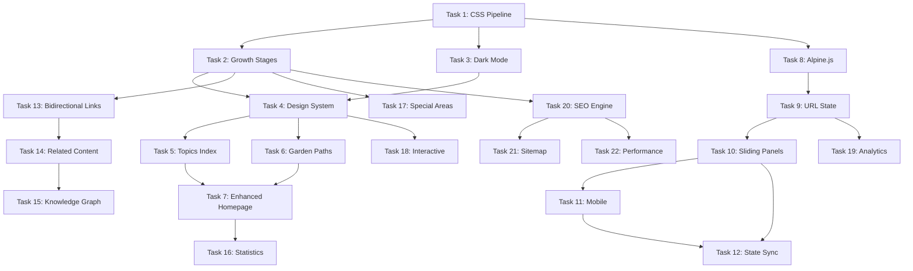

# Digital Garden Modernization: TDD Implementation Plan

## 1. Overview

This plan transforms an existing FastAPI blog into a modern digital garden following Test-Driven Development principles. The implementation maintains zero breaking changes while introducing sophisticated features including a sliding notes interface, topographical navigation, and garden-themed design.

### Key Principles
- **Test-First Development**: Write tests before implementation
- **Incremental Progress**: Each task builds on previous work
- **No Orphaned Code**: Every feature integrates immediately
- **Bookmarkable by Design**: All states are URL-driven
- **Progressive Enhancement**: Features degrade gracefully

## 2. High-Level Architecture

### System Components

```
┌─────────────────────────────────────────────────────────────┐
│                        Frontend Layer                        │
├─────────────────┬────────────────┬──────────────────────────┤
│   HTMX Partials │  Alpine.js     │  Tailwind CSS           │
│   (Server-side) │  (Client State) │  (Compiled)             │
└────────┬────────┴────────┬────────┴────────┬────────────────┘
         │                 │                  │
         ▼                 ▼                  ▼
┌─────────────────────────────────────────────────────────────┐
│                     FastAPI Application                      │
├──────────────┬─────────────┬────────────────────────────────┤
│ Content Mgr  │ Garden API  │  SEO Engine                    │
│ (Enhanced)   │ (New)       │  (New)                         │
└──────┬───────┴──────┬──────┴───────┬────────────────────────┘
       │              │              │
       ▼              ▼              ▼
┌─────────────────────────────────────────────────────────────┐
│                      Data Layer                              │
├──────────────┬─────────────┬────────────────────────────────┤
│ Markdown     │ YAML        │  Cache (LRU)                   │
│ Content      │ Frontmatter │  5-min TTL                     │
└──────────────┴─────────────┴────────────────────────────────┘
```

### State Management Strategy

1. **URL State** (Source of Truth)
   - Garden walk paths: `/garden-walk?path=note1,note2&focus=1`
   - Filter states: `?tags=python,htmx&status=evergreen`
   - View preferences: `?view=sliding&theme=dark`

2. **Alpine.js State** (UI Reactivity)
   - Panel stack management
   - Animation states
   - Gesture tracking

3. **Server State** (Content & Config)
   - Content cache with LRU eviction
   - Feature flags for gradual rollout
   - SEO metadata generation

## 3. Task Breakdown

### Phase 1: Foundation (4 tasks)

#### Task 1: CSS Pipeline Unification
**Complexity**: 2/5 | **AI Rounds**: ~2 | **Test Coverage**: 3 units
- Remove Tailwind CDN dependency
- Set up compiled CSS pipeline
- Implement feature flag system

#### Task 2: Growth Stages Data Model
**Complexity**: 2/5 | **AI Rounds**: ~3 | **Test Coverage**: 5 units
- Extend BaseContent model
- Add growth stage validation
- Implement vocabulary changes

#### Task 3: Dark Mode Toggle ✅
**Complexity**: 2/5 | **AI Rounds**: ~2 | **Test Coverage**: 4 units
- Implement theme switcher ✅
- Add localStorage persistence ✅
- Create garden color palette ✅
**COMPLETED**: 2025-08-10

#### Task 4: Design System Components
**Complexity**: 3/5 | **AI Rounds**: ~3 | **Test Coverage**: 6 units
- Create garden-themed components
- Implement growth stage indicators
- Add typography system

### Phase 2: Topographical Navigation (3 tasks)

#### Task 5: Topics Index Page
**Complexity**: 3/5 | **AI Rounds**: ~3 | **Test Coverage**: 5 units
- Create /topics route
- Implement tag clustering
- Add HTMX filtering

#### Task 6: Garden Paths System ✅
**Complexity**: 3/5 | **AI Rounds**: ~4 | **Test Coverage**: 6 units
- Define path data structure ✅
- Create curated paths ✅
- Implement progress tracking ✅
**COMPLETED**: 2025-08-10

#### Task 7: Enhanced Homepage Layout
**Complexity**: 3/5 | **AI Rounds**: ~3 | **Test Coverage**: 4 units
- Replace linear feed
- Add topographical sections
- Implement "Recently tended"

### Phase 3: Sliding Notes Interface (5 tasks)

#### Task 8: Alpine.js Integration
**Complexity**: 3/5 | **AI Rounds**: ~3 | **Test Coverage**: 5 units
- Set up Alpine.js
- Create base components
- Test HTMX coordination

#### Task 9: URL State Management
**Complexity**: 4/5 | **AI Rounds**: ~4 | **Test Coverage**: 8 units
- Implement garden-walk endpoint
- Create URL serialization
- Add browser history support

#### Task 10: Sliding Panel UI
**Complexity**: 4/5 | **AI Rounds**: ~5 | **Test Coverage**: 7 units
- Create panel components
- Implement sliding animations
- Add keyboard navigation

#### Task 11: Mobile Adaptation
**Complexity**: 3/5 | **AI Rounds**: ~3 | **Test Coverage**: 5 units
- Vertical stack layout
- Touch gesture support
- Responsive breakpoints

#### Task 12: Panel State Synchronization
**Complexity**: 4/5 | **AI Rounds**: ~4 | **Test Coverage**: 6 units
- HTMX + Alpine.js sync
- Smart stack replacement
- Share functionality

### Phase 4: Content Relationships (3 tasks)

#### Task 13: Bidirectional Linking
**Complexity**: 3/5 | **AI Rounds**: ~4 | **Test Coverage**: 6 units
- Parse internal links
- Generate backlinks
- Create preview popovers

#### Task 14: Related Content Discovery
**Complexity**: 3/5 | **AI Rounds**: ~3 | **Test Coverage**: 5 units
- Tag-based relationships
- Manual curation support
- Companion plants section

#### Task 15: Knowledge Graph (Optional)
**Complexity**: 4/5 | **AI Rounds**: ~4 | **Test Coverage**: 4 units
- D3.js visualization
- Interactive navigation
- Filter controls

### Phase 5: Garden Features (4 tasks)

#### Task 16: Garden Statistics Dashboard
**Complexity**: 2/5 | **AI Rounds**: ~3 | **Test Coverage**: 5 units
- Create /garden-stats route
- Implement metrics tracking
- Add visualizations

#### Task 17: Special Garden Areas
**Complexity**: 2/5 | **AI Rounds**: ~2 | **Test Coverage**: 4 units
- Digital greenhouse (drafts)
- Compost bin (archived)
- Garden journal

#### Task 18: Interactive Elements
**Complexity**: 3/5 | **AI Rounds**: ~3 | **Test Coverage**: 5 units
- Wander button
- Growth animations
- Tend widget

#### Task 19: Path Analytics
**Complexity**: 3/5 | **AI Rounds**: ~3 | **Test Coverage**: 6 units
- Track path usage
- Completion rates
- Popular routes

### Phase 6: SEO Optimization (3 tasks)

#### Task 20: SEO Metadata Engine
**Complexity**: 3/5 | **AI Rounds**: ~3 | **Test Coverage**: 7 units
- Meta tag generation
- Schema.org structured data
- Open Graph tags

#### Task 21: Dynamic Sitemap
**Complexity**: 2/5 | **AI Rounds**: ~2 | **Test Coverage**: 4 units
- XML generation
- Growth stage priorities
- Crawlability optimization

#### Task 22: Performance Optimization
**Complexity**: 3/5 | **AI Rounds**: ~3 | **Test Coverage**: 5 units
- Core Web Vitals
- Resource hints
- Lazy loading

## 4. AI Agent Prompts

### Task 1: CSS Pipeline Unification

```text
You are implementing CSS pipeline unification for a digital garden project following Test-Driven Development (TDD) principles.

**Context:**
You're working on a FastAPI application that currently uses Tailwind CSS via CDN. The project needs to migrate to compiled CSS for better performance and consistency. The existing application has 36+ routes and uses HTMX for dynamic content.

**Your Objective:**
Remove the Tailwind CDN dependency and establish a compiled CSS pipeline with feature flags for gradual rollout.

**TDD Requirements - Write These Tests FIRST:**

1. Test that the compiled CSS file exists at `/static/css/output.css` after build
2. Test that base.html template uses compiled CSS when feature flag is enabled
3. Test that base.html falls back to CDN when feature flag is disabled
4. Test that the npm build:css script generates minified output
5. Test that the watch:css script detects changes and rebuilds
6. Test that feature flags can be toggled via environment variables
7. Test that all existing routes still render correctly with compiled CSS

**Implementation Approach:**
- Create a tailwind.config.js from existing CDN configuration
- Set up npm scripts for building and watching CSS
- Implement FeatureFlags class with ENABLE_COMPILED_CSS flag
- Modify base.html to conditionally load CSS based on feature flag
- Ensure zero breaking changes to existing functionality
- Keep CDN as fallback during transition period

**Integration Steps:**
1. Extract Tailwind config from base.html CDN script tag
2. Create package.json scripts for CSS compilation
3. Update base.html with conditional CSS loading
4. Add FeatureFlags class to app/config.py
5. Test with feature flag both enabled and disabled
6. Verify all 36 existing routes render correctly

Remember: Write tests first, then implement only enough code to make them pass.
```

### Task 2: Growth Stages Data Model

```text
You are implementing the growth stages system for a digital garden following Test-Driven Development (TDD) principles.

**Context from Previous Tasks:**
- Task 1: CSS pipeline has been unified with compiled Tailwind CSS and feature flags system is in place

**Your Objective:**
Extend the existing Pydantic BaseContent model to support growth stages (seedling, budding, growing, evergreen) and implement vocabulary changes from "created/updated" to "planted/tended".

**TDD Requirements - Write These Tests FIRST:**

1. Test that BaseContent model accepts valid growth_stage values
2. Test that invalid growth_stage values raise ValidationError
3. Test that growth_stage defaults to "seedling" for new content
4. Test that tended_count increments when content is updated
5. Test that vocabulary mapping converts "created" to "planted" in templates
6. Test that vocabulary mapping converts "updated" to "tended" in templates
7. Test that existing content without growth_stage loads with default value
8. Test that growth stage colors and emojis map correctly
9. Test that garden_bed field is optional and validates as string
10. Test that connections field stores list of content IDs

**Implementation Approach:**
- Add growth_stage field to BaseContent with Enum validation
- Add tended_count, connections, and garden_bed fields
- Create GROWTH_STAGES constant with emoji and color mappings
- Implement vocabulary helper functions for template rendering
- Ensure backward compatibility with existing content
- Create migration utility for existing YAML frontmatter

**Integration Steps:**
1. Update app/models.py with new fields
2. Create growth stages enum and validation
3. Add vocabulary mapping utilities
4. Update content parsing in ContentManager
5. Modify templates to use new vocabulary
6. Test with both new and existing content files

Remember: Write tests first, then implement only enough code to make them pass.
```

### Task 3: Dark Mode Toggle

```text
You are implementing a dark mode toggle for the digital garden following Test-Driven Development (TDD) principles.

**Context from Previous Tasks:**
- Task 1: CSS pipeline unified with feature flags system
- Task 2: Growth stages model with garden vocabulary implemented

**Your Objective:**
Create a dark mode toggle that persists user preference and applies garden-themed night colors.

**TDD Requirements - Write These Tests FIRST:**

1. Test that dark mode toggle button exists in the UI
2. Test that clicking toggle adds 'dark' class to html element
3. Test that dark mode preference persists in localStorage
4. Test that page loads with saved dark mode preference
5. Test that dark mode uses correct color palette (deep blue-black background)
6. Test that contrast ratios meet WCAG AA standards in dark mode
7. Test that toggle state syncs across multiple tabs
8. Test that system preference is respected if no user preference exists

**Implementation Approach:**
- Use Alpine.js for toggle component state
- Store preference in localStorage as 'theme'
- Apply 'dark' class to html element
- Define dark mode colors in Tailwind config
- Use CSS custom properties for theme colors
- Implement system preference detection as fallback

**Integration Steps:**
1. Add dark mode colors to tailwind.config.js
2. Create Alpine.js toggle component
3. Add theme detection script to base.html
4. Update all color classes to support dark variants
5. Test toggle functionality across all content types
6. Verify accessibility standards are met

Remember: Write tests first, then implement only enough code to make them pass.
```

### Task 4: Design System Components

```text
You are implementing garden-themed design system components following Test-Driven Development (TDD) principles.

**Context from Previous Tasks:**
- Task 1: CSS pipeline unified with Tailwind
- Task 2: Growth stages model implemented
- Task 3: Dark mode toggle functional

**Your Objective:**
Create reusable garden-themed components including growth stage indicators, garden cards, and enhanced typography.

**TDD Requirements - Write These Tests FIRST:**

1. Test that growth stage indicator displays correct emoji for each stage
2. Test that growth stage indicator shows correct color (stone/amber/lime/emerald)
3. Test that garden card component renders with all required fields
4. Test that typography uses serif font for content (Crimson Text/Merriweather)
5. Test that typography uses sans-serif for UI elements (Inter)
6. Test that fluid typography scales correctly across breakpoints
7. Test that drop caps render for article content when enabled
8. Test that "planted/tended" dates display with garden vocabulary
9. Test that components work in both light and dark modes
10. Test that components are accessible with proper ARIA labels

**Implementation Approach:**
- Create Jinja2 macro components for reusability
- Use Tailwind's component layer for custom styles
- Implement fluid typography with clamp() CSS
- Add Google Fonts for serif typography
- Create consistent spacing and sizing system
- Ensure all components support dark mode

**Integration Steps:**
1. Create app/templates/components/ directory
2. Add growth_stage_indicator.html macro
3. Add garden_card.html macro
4. Update base.html with new fonts
5. Add typography utilities to CSS
6. Update existing templates to use new components
7. Test components across all content types

Remember: Write tests first, then implement only enough code to make them pass.
```

### Task 5: Topics Index Page

```text
You are implementing a topics index page for topographical navigation following Test-Driven Development (TDD) principles.

**Context from Previous Tasks:**
- Tasks 1-4: Foundation complete with CSS pipeline, growth stages, dark mode, and design system components

**Your Objective:**
Create a /topics route that displays all tags with post counts, grouped into "garden beds" with visual clustering and HTMX-powered filtering.

**TDD Requirements - Write These Tests FIRST:**

1. Test that GET /topics returns 200 status code
2. Test that topics page displays all unique tags from content
3. Test that each tag shows correct post count
4. Test that tags are grouped into garden beds (e.g., Programming, Web Development)
5. Test that clicking a tag filters content via HTMX
6. Test that multiple tags can be selected for filtering
7. Test that filtered results load without page refresh
8. Test that topic counts update when content is added/removed
9. Test that empty garden beds are not displayed
10. Test that topics page is mobile responsive

**Implementation Approach:**
- Create new /topics route in main.py
- Aggregate tags from all content types
- Map tags to predefined garden beds
- Implement HTMX partial for filtered results
- Use Alpine.js for multi-select state
- Create visual clustering with CSS Grid

**Integration Steps:**
1. Add /topics route to app/main.py
2. Create topics.html template
3. Add topic aggregation to ContentManager
4. Create garden bed mapping configuration
5. Implement HTMX filtering endpoint
6. Add visual styling for topic clusters
7. Test with various content combinations

Remember: Write tests first, then implement only enough code to make them pass.
```

### Task 6: Garden Paths System

```text
You are implementing a garden paths system for curated content sequences following Test-Driven Development (TDD) principles.

**Context from Previous Tasks:**
- Tasks 1-4: Foundation complete
- Task 5: Topics index with tag clustering implemented

**Your Objective:**
Create a system for defining and navigating curated garden paths with manual definition in frontmatter and progress tracking.

**TDD Requirements - Write These Tests FIRST:**

1. Test that garden paths can be defined in content frontmatter
2. Test that path sequences maintain order
3. Test that GET /garden-path/{name} redirects to garden-walk URL
4. Test that paths have name, description, and note list
5. Test that progress through path is tracked in URL state
6. Test that visual path indicators show current position
7. Test that "next" and "previous" navigation works within paths
8. Test that completed paths are marked as such
9. Test that invalid path names return 404
10. Test that paths can be shared via URL

**Implementation Approach:**
- Add path definition to frontmatter schema
- Create CURATED_PATHS configuration
- Implement path navigation endpoints
- Add progress indicators to UI
- Use URL parameters for state tracking
- Create path completion detection

**Integration Steps:**
1. Update models.py with path fields
2. Add CURATED_PATHS to configuration
3. Create /garden-path/{name} route
4. Implement path navigation UI
5. Add progress tracking logic
6. Create path indicator components
7. Test with multiple path definitions

Remember: Write tests first, then implement only enough code to make them pass.
```

### Task 7: Enhanced Homepage Layout

```text
You are implementing an enhanced homepage with topographical layout following Test-Driven Development (TDD) principles.

**Context from Previous Tasks:**
- Tasks 1-4: Foundation complete
- Task 5: Topics index implemented
- Task 6: Garden paths system created

**Your Objective:**
Replace the linear chronological feed with a topographical layout featuring "Recently tended" sections and topic-based organization.

**TDD Requirements - Write These Tests FIRST:**

1. Test that homepage displays "Recently tended" section
2. Test that content is grouped by garden beds/topics
3. Test that growth stage indicators appear on homepage cards
4. Test that "Explore by topic" call-to-action links to /topics
5. Test that homepage loads within 2 seconds
6. Test that infinite scroll still works with new layout
7. Test that mobile layout stacks sections vertically
8. Test that featured content appears prominently
9. Test that empty sections are hidden
10. Test that homepage uses caching effectively

**Implementation Approach:**
- Modify index route to use topographical template
- Group content by garden beds
- Sort by "last tended" date
- Create visual hierarchy with sections
- Maintain HTMX infinite scroll
- Use CSS Grid for desktop layout

**Integration Steps:**
1. Create garden_index.html template
2. Modify index route logic
3. Add content grouping to ContentManager
4. Implement section-based layout
5. Update infinite scroll endpoints
6. Add responsive breakpoints
7. Test performance with large content sets

Remember: Write tests first, then implement only enough code to make them pass.
```

### Task 8: Alpine.js Integration

```text
You are setting up Alpine.js for client-side state management following Test-Driven Development (TDD) principles.

**Context from Previous Tasks:**
- Tasks 1-7: Foundation and topographical navigation complete

**Your Objective:**
Integrate Alpine.js (15KB) for managing sliding panel state and coordinating with HTMX.

**TDD Requirements - Write These Tests FIRST:**

1. Test that Alpine.js loads from CDN or local file
2. Test that Alpine.js initializes without errors
3. Test that Alpine components can manage local state
4. Test that Alpine x-data binds to elements correctly
5. Test that Alpine event handlers (@click) work
6. Test that Alpine can read/write from localStorage
7. Test that Alpine state changes trigger DOM updates
8. Test that Alpine works alongside HTMX without conflicts
9. Test that Alpine components can communicate via events
10. Test that Alpine performance impact is minimal (<50ms)

**Implementation Approach:**
- Add Alpine.js script to base.html
- Create base Alpine components structure
- Test state management patterns
- Implement event bus for component communication
- Ensure HTMX and Alpine coordinate properly
- Use x-init for component initialization

**Integration Steps:**
1. Add Alpine.js to base.html
2. Create garden-walk.js with Alpine components
3. Test basic state management
4. Implement localStorage utilities
5. Create event handling patterns
6. Verify HTMX compatibility
7. Measure performance impact

Remember: Write tests first, then implement only enough code to make them pass.
```

### Task 9: URL State Management

```text
You are implementing URL-driven state management for bookmarkable garden walks following Test-Driven Development (TDD) principles.

**Context from Previous Tasks:**
- Tasks 1-7: Foundation and navigation complete
- Task 8: Alpine.js integrated for client state

**Your Objective:**
Create a garden-walk endpoint with full URL state preservation for bookmarkable and shareable garden exploration.

**TDD Requirements - Write These Tests FIRST:**

1. Test that GET /garden-walk accepts path parameter (comma-separated note IDs)
2. Test that focus parameter indicates active panel (0-indexed)
3. Test that view parameter switches between sliding/stacked/single modes
4. Test that URL updates preserve all state parameters
5. Test that browser back/forward navigation works correctly
6. Test that URLs remain under 2000 character limit
7. Test that invalid parameters return sensible defaults
8. Test that shared URLs restore exact state
9. Test that URL encoding handles special characters
10. Test that state persists across page refreshes
11. Test that deep links to specific panels work
12. Test that URL state syncs with Alpine.js state

**Implementation Approach:**
- Create /garden-walk route with Query parameters
- Implement URL serialization/deserialization
- Use History API for navigation
- Coordinate URL state with Alpine.js
- Handle edge cases (long paths, invalid IDs)
- Implement URL shortening if needed

**Integration Steps:**
1. Add /garden-walk route to main.py
2. Create URL state parser
3. Implement History API management
4. Sync URL with Alpine.js state
5. Add URL validation and limits
6. Create state restoration logic
7. Test with various URL patterns

Remember: Write tests first, then implement only enough code to make them pass.
```

### Task 10: Sliding Panel UI

```text
You are implementing the sliding panel user interface following Test-Driven Development (TDD) principles.

**Context from Previous Tasks:**
- Tasks 1-8: Foundation and Alpine.js ready
- Task 9: URL state management implemented

**Your Objective:**
Create the core sliding panel interface with horizontal sliding on desktop, animations, and keyboard navigation.

**TDD Requirements - Write These Tests FIRST:**

1. Test that panels render side-by-side on desktop (>1024px)
2. Test that panels slide horizontally when navigating
3. Test that animation runs at 60fps
4. Test that panels get smaller/dimmer with depth
5. Test that maximum 5 panels show simultaneously
6. Test that clicking a link opens new panel to the right
7. Test that ESC key closes current panel
8. Test that arrow keys navigate between panels
9. Test that panels have close (X) buttons
10. Test that panel width adjusts based on viewport
11. Test that z-index stacking is correct
12. Test that focus management works for accessibility

**Implementation Approach:**
- Use CSS transforms for smooth sliding
- Implement panel width calculations
- Add keyboard event listeners
- Create visual depth indicators
- Use Alpine.js for panel state
- Ensure animations use GPU acceleration

**Integration Steps:**
1. Create sliding_panel.html partial
2. Add CSS for panel layout and animations
3. Implement Alpine.js panel manager
4. Add keyboard navigation
5. Create panel stacking logic
6. Test animation performance
7. Verify accessibility features

Remember: Write tests first, then implement only enough code to make them pass.
```

### Task 11: Mobile Adaptation

```text
You are implementing mobile adaptation for the sliding panel interface following Test-Driven Development (TDD) principles.

**Context from Previous Tasks:**
- Tasks 1-9: Foundation and URL state complete
- Task 10: Desktop sliding panel UI implemented

**Your Objective:**
Adapt the sliding panel interface for mobile devices with vertical stacking, touch gestures, and responsive breakpoints.

**TDD Requirements - Write These Tests FIRST:**

1. Test that panels stack vertically on mobile (<768px)
2. Test that swipe up/down navigates between panels
3. Test that pinch gesture closes panel
4. Test that panels show peek preview of next/previous
5. Test that touch events don't conflict with scrolling
6. Test that viewport meta tag prevents zoom issues
7. Test that bottom sheet pattern works for filters
8. Test that mobile menu adapts for garden navigation
9. Test that performance remains smooth on mobile
10. Test that orientation changes are handled correctly

**Implementation Approach:**
- Use CSS Grid for mobile layout
- Implement touch event handlers
- Add swipe gesture detection
- Create peek preview animations
- Use viewport units for sizing
- Optimize for mobile performance

**Integration Steps:**
1. Add responsive breakpoints to CSS
2. Create touch event handlers
3. Implement swipe detection logic
4. Add mobile-specific animations
5. Update Alpine.js for mobile state
6. Test on various devices
7. Optimize performance for mobile

Remember: Write tests first, then implement only enough code to make them pass.
```

### Task 12: Panel State Synchronization

```text
You are implementing panel state synchronization between HTMX and Alpine.js following Test-Driven Development (TDD) principles.

**Context from Previous Tasks:**
- Tasks 1-10: Sliding panel UI complete
- Task 11: Mobile adaptation implemented

**Your Objective:**
Synchronize panel state between server-side HTMX and client-side Alpine.js with smart stack replacement and sharing functionality.

**TDD Requirements - Write These Tests FIRST:**

1. Test that HTMX panel loads trigger Alpine state updates
2. Test that Alpine state changes update HTMX targets
3. Test that revisiting a note replaces its position in stack
4. Test that panel stack maintains correct order
5. Test that share button generates correct URL
6. Test that native share API works on mobile
7. Test that clipboard copy fallback works
8. Test that state events propagate correctly
9. Test that race conditions are handled
10. Test that memory leaks are prevented with panel cleanup
11. Test that htmx:afterSwap events update Alpine
12. Test that state remains consistent across interactions

**Implementation Approach:**
- Use custom events for state synchronization
- Implement smart stack replacement algorithm
- Add share functionality with multiple methods
- Handle HTMX lifecycle events
- Prevent memory leaks with cleanup
- Use debouncing for state updates

**Integration Steps:**
1. Create state synchronization module
2. Add HTMX event listeners
3. Implement stack management logic
4. Add share functionality
5. Create cleanup routines
6. Test state consistency
7. Verify memory management

Remember: Write tests first, then implement only enough code to make them pass.
```

### Task 13: Bidirectional Linking

```text
You are implementing bidirectional linking for content relationships following Test-Driven Development (TDD) principles.

**Context from Previous Tasks:**
- Tasks 1-12: Sliding panel interface complete with state management

**Your Objective:**
Parse internal links during rendering, generate "Referenced by" sections, and create preview popovers for linked content.

**TDD Requirements - Write These Tests FIRST:**

1. Test that internal links are detected during markdown parsing
2. Test that backlinks are automatically generated
3. Test that "Referenced by" section appears in content
4. Test that circular references are handled correctly
5. Test that link preview shows on hover (desktop)
6. Test that link preview shows correct content excerpt
7. Test that broken internal links are detected
8. Test that external links are not processed
9. Test that backlink counts are accurate
10. Test that preview popovers are accessible
11. Test that backlinks update when content changes

**Implementation Approach:**
- Extend markdown parser to detect internal links
- Build backlink index during content loading
- Create preview API endpoint
- Implement hover preview with Alpine.js
- Cache backlink relationships
- Handle edge cases (circular, broken links)

**Integration Steps:**
1. Modify markdown parser in ContentManager
2. Create backlink indexing system
3. Add /api/preview/{type}/{name} endpoint
4. Create preview popover component
5. Update content templates with backlinks
6. Implement caching strategy
7. Test with complex link networks

Remember: Write tests first, then implement only enough code to make them pass.
```

### Task 14: Related Content Discovery

```text
You are implementing related content discovery with tag-based relationships following Test-Driven Development (TDD) principles.

**Context from Previous Tasks:**
- Tasks 1-12: Sliding panel interface complete
- Task 13: Bidirectional linking implemented

**Your Objective:**
Create a "Companion plants" section showing related content based on tags and manual curation.

**TDD Requirements - Write These Tests FIRST:**

1. Test that related content algorithm finds tag matches
2. Test that similarity score ranks content correctly
3. Test that manual related links override algorithm
4. Test that companion plants section renders in template
5. Test that maximum 5 related items are shown
6. Test that same content isn't recommended
7. Test that related content respects growth stages
8. Test that empty related section is hidden
9. Test that related content links work in panels
10. Test that performance is acceptable (<100ms)

**Implementation Approach:**
- Calculate tag similarity scores
- Support manual curation in frontmatter
- Implement weighted scoring algorithm
- Create companion plants UI component
- Cache relationship calculations
- Prioritize evergreen content

**Integration Steps:**
1. Add related content algorithm to ContentManager
2. Update frontmatter schema for manual relations
3. Create companion_plants.html component
4. Integrate with content templates
5. Implement caching for relationships
6. Test algorithm accuracy
7. Optimize performance

Remember: Write tests first, then implement only enough code to make them pass.
```

### Task 15: Knowledge Graph (Optional)

```text
You are implementing an optional knowledge graph visualization following Test-Driven Development (TDD) principles.

**Context from Previous Tasks:**
- Tasks 1-13: Core features complete
- Task 14: Related content discovery implemented

**Your Objective:**
Create a D3.js-powered knowledge graph showing content relationships with interactive navigation.

**TDD Requirements - Write These Tests FIRST:**

1. Test that /api/graph returns JSON graph data
2. Test that nodes represent content items
3. Test that edges represent relationships
4. Test that node size reflects connection count
5. Test that node color indicates growth stage
6. Test that clicking node navigates to content
7. Test that graph renders within 2 seconds
8. Test that zoom/pan controls work
9. Test that filters (topic/date/stage) update graph
10. Test that graph is hidden on mobile by default

**Implementation Approach:**
- Generate graph data from content relationships
- Use D3.js force-directed layout
- Implement zoom/pan with d3-zoom
- Add interactive filters
- Optimize for performance
- Make feature toggleable

**Integration Steps:**
1. Add /api/graph endpoint
2. Create graph.html template
3. Implement D3.js visualization
4. Add interactive controls
5. Create filter system
6. Optimize rendering performance
7. Add feature flag for optional display

Remember: Write tests first, then implement only enough code to make them pass.
```

### Task 16: Garden Statistics Dashboard

```text
You are implementing a garden statistics dashboard following Test-Driven Development (TDD) principles.

**Context from Previous Tasks:**
- Tasks 1-14: Core garden features complete
- Task 15: Optional knowledge graph added

**Your Objective:**
Create a /garden-stats route displaying metrics about content, growth, and garden paths.

**TDD Requirements - Write These Tests FIRST:**

1. Test that GET /garden-stats returns 200 status
2. Test that total "seeds planted" count is correct
3. Test that garden beds (topics) are counted
4. Test that cross-pollination (connections) metric works
5. Test that growth timeline visualization renders
6. Test that popular garden paths are identified
7. Test that path completion rates are calculated
8. Test that stats update when content changes
9. Test that dashboard loads within 2 seconds
10. Test that mobile layout is responsive

**Implementation Approach:**
- Aggregate statistics from ContentManager
- Create visual charts for metrics
- Calculate path analytics
- Implement caching for performance
- Use CSS Grid for dashboard layout
- Add growth visualizations

**Integration Steps:**
1. Add /garden-stats route
2. Create statistics aggregation logic
3. Build garden_stats.html template
4. Add visualization components
5. Implement caching strategy
6. Create responsive layout
7. Test with various data volumes

Remember: Write tests first, then implement only enough code to make them pass.
```

### Task 17: Special Garden Areas

```text
You are implementing special garden areas (greenhouse, compost, journal) following Test-Driven Development (TDD) principles.

**Context from Previous Tasks:**
- Tasks 1-16: Core features and statistics complete

**Your Objective:**
Create special sections for draft content (greenhouse), archived ideas (compost), and public learning log (journal).

**TDD Requirements - Write These Tests FIRST:**

1. Test that /greenhouse shows draft content only
2. Test that /compost shows archived content
3. Test that /journal shows chronological learning log
4. Test that greenhouse content has "draft" indicator
5. Test that compost content has "archived" indicator
6. Test that journal entries sort by date
7. Test that special areas respect access controls
8. Test that navigation includes special areas
9. Test that content moves between areas correctly
10. Test that special area templates render properly

**Implementation Approach:**
- Filter content by status field
- Create dedicated routes for each area
- Design unique templates for each section
- Add navigation menu items
- Implement content lifecycle management
- Use appropriate metaphors in UI

**Integration Steps:**
1. Add routes for special areas
2. Create filtering logic in ContentManager
3. Build area-specific templates
4. Update navigation menus
5. Add status transition logic
6. Test content lifecycle
7. Verify template rendering

Remember: Write tests first, then implement only enough code to make them pass.
```

### Task 18: Interactive Elements

```text
You are implementing interactive garden elements following Test-Driven Development (TDD) principles.

**Context from Previous Tasks:**
- Tasks 1-17: Garden areas and statistics complete

**Your Objective:**
Add interactive elements including a "Wander" button for random discovery, growth animations, and a "Tend this note" widget.

**TDD Requirements - Write These Tests FIRST:**

1. Test that Wander button returns random content
2. Test that random selection excludes current page
3. Test that growth animations trigger on status change
4. Test that animations run smoothly (60fps)
5. Test that Tend widget increments tended_count
6. Test that last_tended date updates correctly
7. Test that seasonal themes apply if enabled
8. Test that interactive elements are keyboard accessible
9. Test that animations respect prefers-reduced-motion
10. Test that interactions work on mobile

**Implementation Approach:**
- Implement random content selection algorithm
- Create CSS animations for growth transitions
- Add tend functionality with optimistic UI
- Use Alpine.js for interactive state
- Respect accessibility preferences
- Optional seasonal theme variations

**Integration Steps:**
1. Add /wander endpoint for random content
2. Create growth animation CSS
3. Build tend widget component
4. Implement seasonal theme logic
5. Add accessibility features
6. Test on various devices
7. Optimize animation performance

Remember: Write tests first, then implement only enough code to make them pass.
```

### Task 19: Path Analytics

```text
You are implementing garden path analytics tracking following Test-Driven Development (TDD) principles.

**Context from Previous Tasks:**
- Tasks 1-18: Interactive elements complete

**Your Objective:**
Track how users navigate garden paths, including starts, completions, and popular routes.

**TDD Requirements - Write These Tests FIRST:**

1. Test that path start events are tracked
2. Test that path completion events are recorded
3. Test that abandon events are detected
4. Test that time spent on paths is measured
5. Test that popular paths are identified
6. Test that completion rates are calculated
7. Test that analytics respect privacy settings
8. Test that data persists across sessions
9. Test that analytics API returns correct format
10. Test that dashboard displays analytics correctly

**Implementation Approach:**
- Create event tracking system
- Store analytics in lightweight format
- Calculate metrics on demand
- Respect user privacy preferences
- Use localStorage for client-side tracking
- Aggregate data server-side

**Integration Steps:**
1. Add /api/garden-walk/track endpoint
2. Create analytics data model
3. Implement event tracking JavaScript
4. Add metrics calculation logic
5. Update dashboard with analytics
6. Test privacy compliance
7. Verify data accuracy

Remember: Write tests first, then implement only enough code to make them pass.
```

### Task 20: SEO Metadata Engine

```text
You are implementing a comprehensive SEO metadata engine following Test-Driven Development (TDD) principles.

**Context from Previous Tasks:**
- Tasks 1-19: All garden features complete

**Your Objective:**
Create an SEO engine that generates meta tags, Schema.org structured data, and Open Graph tags with growth stage awareness.

**TDD Requirements - Write These Tests FIRST:**

1. Test that all pages have unique meta titles (<60 chars)
2. Test that meta descriptions are generated (<155 chars)
3. Test that Schema.org BlogPosting data is valid
4. Test that LearningResource schema includes education level
5. Test that Open Graph tags are present and correct
6. Test that Twitter Card tags are properly formatted
7. Test that canonical URLs are absolute
8. Test that growth stage affects indexing directives
9. Test that breadcrumb schema is generated
10. Test that structured data validates with Google tool
11. Test that keywords are extracted from tags
12. Test that author information is included

**Implementation Approach:**
- Create SEOMetadata Pydantic model
- Generate descriptions from content excerpts
- Map growth stages to indexing priorities
- Implement Schema.org templates
- Add Open Graph image support
- Ensure all URLs are absolute

**Integration Steps:**
1. Create SEO metadata generator class
2. Add structured data templates
3. Update base.html with meta tags
4. Implement growth stage logic
5. Add validation tests
6. Test with SEO tools
7. Verify search engine compatibility

Remember: Write tests first, then implement only enough code to make them pass.
```

### Task 21: Dynamic Sitemap

```text
You are implementing dynamic sitemap generation following Test-Driven Development (TDD) principles.

**Context from Previous Tasks:**
- Tasks 1-20: SEO metadata engine complete

**Your Objective:**
Generate a dynamic XML sitemap with growth stage priorities and proper crawlability directives.

**TDD Requirements - Write These Tests FIRST:**

1. Test that /sitemap.xml returns valid XML
2. Test that all published content appears in sitemap
3. Test that draft content is excluded
4. Test that URLs are absolute
5. Test that lastmod dates are ISO formatted
6. Test that priority reflects growth stage (evergreen=1.0)
7. Test that changefreq is set appropriately
8. Test that sitemap updates when content changes
9. Test that response has correct XML content-type
10. Test that sitemap is referenced in robots.txt

**Implementation Approach:**
- Use xml.etree.ElementTree for XML generation
- Calculate priority from growth stages
- Set changefreq based on tended_count
- Cache sitemap with invalidation
- Include all content types
- Exclude draft/archived content

**Integration Steps:**
1. Add /sitemap.xml endpoint
2. Create XML generation logic
3. Implement priority mapping
4. Add caching strategy
5. Update robots.txt
6. Test XML validity
7. Verify with search console

Remember: Write tests first, then implement only enough code to make them pass.
```

### Task 22: Performance Optimization

```text
You are implementing performance optimizations for Core Web Vitals following Test-Driven Development (TDD) principles.

**Context from Previous Tasks:**
- Tasks 1-21: All features complete including SEO

**Your Objective:**
Optimize performance to meet Core Web Vitals targets: LCP < 2.5s, FID < 100ms, CLS < 0.1.

**TDD Requirements - Write These Tests FIRST:**

1. Test that LCP (Largest Contentful Paint) < 2.5 seconds
2. Test that FID (First Input Delay) < 100ms
3. Test that CLS (Cumulative Layout Shift) < 0.1
4. Test that critical CSS is inlined
5. Test that fonts are preloaded
6. Test that images have explicit dimensions
7. Test that images below fold are lazy loaded
8. Test that JavaScript is deferred appropriately
9. Test that resource hints are present
10. Test that gzip compression is enabled
11. Test that cache headers are set correctly
12. Test that TTFB (Time to First Byte) < 600ms

**Implementation Approach:**
- Inline critical CSS in <head>
- Preload critical fonts and resources
- Add explicit width/height to images
- Implement lazy loading for images
- Defer non-critical JavaScript
- Add resource hints (prefetch/preconnect)

**Integration Steps:**
1. Identify critical CSS path
2. Add preload directives to base.html
3. Implement image lazy loading
4. Add resource hints
5. Configure caching headers
6. Enable compression
7. Test with Lighthouse

Remember: Write tests first, then implement only enough code to make them pass.
```

## 5. Dependency Graph



## 6. Testing Strategy

### Unit Testing
- **Models**: Test all Pydantic model validations
- **Utilities**: Test helper functions in isolation
- **Components**: Test Alpine.js components
- **Parsers**: Test markdown and YAML parsing

### Integration Testing
- **API Endpoints**: Test all routes with various inputs
- **HTMX + Alpine**: Test state synchronization
- **Templates**: Test rendering with edge cases
- **Caching**: Test cache invalidation

### End-to-End Testing
- **User Journeys**: Complete garden walk flows
- **Cross-Browser**: Chrome, Firefox, Safari
- **Mobile**: iOS Safari, Chrome Mobile
- **Performance**: Lighthouse CI automation

### Performance Testing
- **Load Testing**: Concurrent users simulation
- **Memory**: Panel memory management
- **Animation**: 60fps verification
- **Core Web Vitals**: Automated monitoring

## 7. Risk Mitigation

### Technical Risks
1. **Alpine.js + HTMX Conflicts**
   - Mitigation: Early prototype, fallback to pure HTMX
   - Test: Integration tests from Task 8

2. **URL Length Limits**
   - Mitigation: URL shortening service, path compression
   - Test: Boundary testing in Task 9

3. **Mobile Performance**
   - Mitigation: Progressive enhancement, reduced animations
   - Test: Device testing in Task 11

### Rollback Strategy
- Feature flags for all new features
- Gradual percentage-based rollout
- One-command rollback script
- Backup of critical files before deployment

## 8. Success Metrics

### Functional Metrics
- [ ] All 22 tasks completed with tests passing
- [ ] Zero breaking changes to existing functionality
- [ ] All new features work on mobile and desktop
- [ ] URL state management fully functional

### Performance Metrics
- [ ] Page load time < 2 seconds
- [ ] Lighthouse score > 90
- [ ] Core Web Vitals passing
- [ ] 60fps animations

### Quality Metrics
- [ ] Test coverage > 80%
- [ ] No accessibility violations
- [ ] SEO validation passing
- [ ] Cross-browser compatibility verified

## 9. Timeline

### Week 1-2: Foundation (Tasks 1-4)
Establish CSS pipeline, growth stages, dark mode, and design system

### Week 3-4: Navigation (Tasks 5-7)
Implement topographical navigation and enhanced homepage

### Week 5-6: Sliding Interface (Tasks 8-12)
Build core sliding panel functionality with state management

### Week 7: Relationships (Tasks 13-15)
Add content relationships and optional knowledge graph

### Week 8: Garden Features (Tasks 16-19)
Implement statistics, special areas, and analytics

### Week 9: SEO & Performance (Tasks 20-22)
Optimize for search engines and performance

### Week 10: Testing & Polish
Comprehensive testing, bug fixes, and deployment preparation

---

This plan provides a complete roadmap for transforming the blog into a digital garden using Test-Driven Development. Each task includes specific tests to write first, ensuring quality and preventing regressions throughout the implementation.